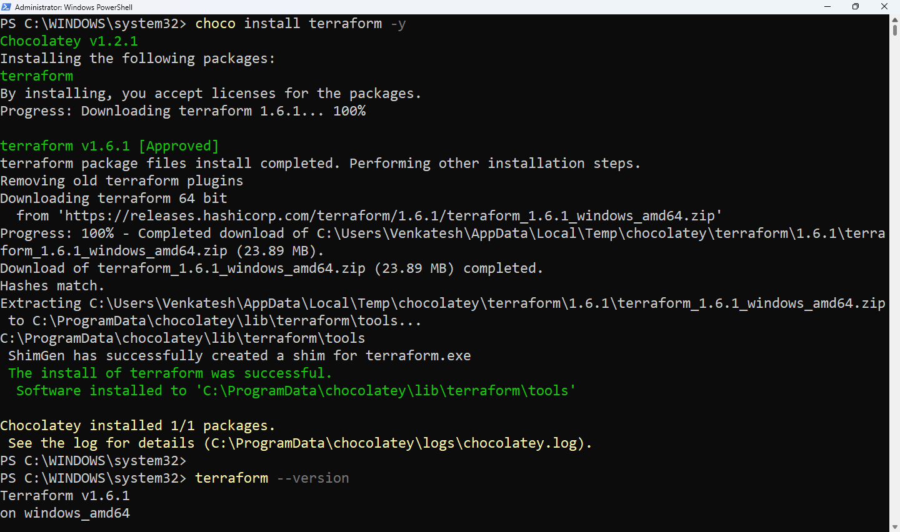

# Installation de Terraform

## Windows

La façon la plus simple d'installer et configurer Terraform sur Windows est via [chocolatey](https://chocolatey.org/)

1. Téléchargez et installez Chocolatey comme indiqué ici [https://chocolatey.org/install](https://chocolatey.org/install)

2. Installez Terraform via chocolatey avec la commande ci-dessous ou consultez [https://community.chocolatey.org/packages/terraform](https://community.chocolatey.org/packages/terraform)
   
   ```
   choco install terraform -y
   ```
   
    
   
   ## Linux
* [Installation de Terraform sur Linux](https://learn.hashicorp.com/tutorials/terraform/install-cli)

Assurez-vous que votre système est à jour et que vous avez installé les paquets `gnupg`nécessaires `software-properties-common`.

```bash
sudo apt-get update && sudo apt-get install -y gnupg software-properties-common
```

Installez la clé GPG de HashiCorp.

```bash
wget -O- https://apt.releases.hashicorp.com/gpg | \
gpg --dearmor | \
sudo tee /usr/share/keyrings/hashicorp-archive-keyring.gpg > /dev/null
```

Vérifiez l'empreinte numérique de la clé GPG.

```bash
gpg --no-default-keyring \
--keyring /usr/share/keyrings/hashicorp-archive-keyring.gpg \
--fingerprint
```

La `gpg`commande renvoie l'empreinte de la clé :

```bash
/usr/share/keyrings/hashicorp-archive-keyring.gpg
-------------------------------------------------
pub   rsa4096 XXXX-XX-XX [SC]
AAAA AAAA AAAA AAAA
uid         [ unknown] HashiCorp Security (HashiCorp Package Signing) <security+packaging@hashicorp.com>
sub   rsa4096 XXXX-XX-XX [E]
```

Ajoutez le dépôt officiel HashiCorp à votre système.

```bash
echo "deb [arch=$(dpkg --print-architecture) signed-by=/usr/share/keyrings/hashicorp-archive-keyring.gpg] https://apt.releases.hashicorp.com $(grep -oP '(?<=UBUNTU_CODENAME=).*' /etc/os-release || lsb_release -cs) main" | sudo tee /etc/apt/sources.list.d/hashicorp.list
```

Mettez à jour apt pour télécharger les informations du paquet depuis le dépôt HashiCorp.

```bash
sudo apt update
```

Installez Terraform à partir du nouveau dépôt.

```bash
sudo apt-get install terraform
```

Fin d'installation

### Versions et compatibilité de Terraform

HashiCorp publie régulièrement de nouvelles versions de Terraform intégrant de nouvelles fonctionnalités et des correctifs.

### Post installation- Activer la complétion par tabulation

Si vous utilisez Bash ou Zsh comme interpréteur de commandes, vous pouvez activer la complétion automatique pour les commandes Terraform.

```bash
nano ~/.bashrc
```

Installez ensuite le module d'autocomplétion. 

```bash
terraform -install-autocomplete
```

Confirmez l'installation 

```bash
source ~/.bashrc
```

## Prochaines étapes

Maintenant que Terraform est installé, vous pouvez l'utiliser pour créer et gérer une infrastructure avec le fournisseur cloud de votre choix. Commencez avec l'un des fournisseurs suivants :

- [Amazon Web Services ( AWS )](https://developer.hashicorp.com/terraform/tutorials/aws-get-started/aws-create)
- [Microsoft Azure](https://developer.hashicorp.com/terraform/tutorials/azure-get-started/azure-build)
- [Google Cloud Platform ( GCP )](https://developer.hashicorp.com/terraform/tutorials/gcp-get-started/google-cloud-platform-build)
- [Oracle Cloud Infrastructure ( OCI )](https://developer.hashicorp.com/terraform/tutorials/oci-get-started/oci-build)

## Autres références

* [https://www.terraform.io/downloads](https://www.terraform.io/downloads)
* [https://learn.hashicorp.com/terraform/getting-started/install.html](https://learn.hashicorp.com/terraform/getting-started/install.html)
