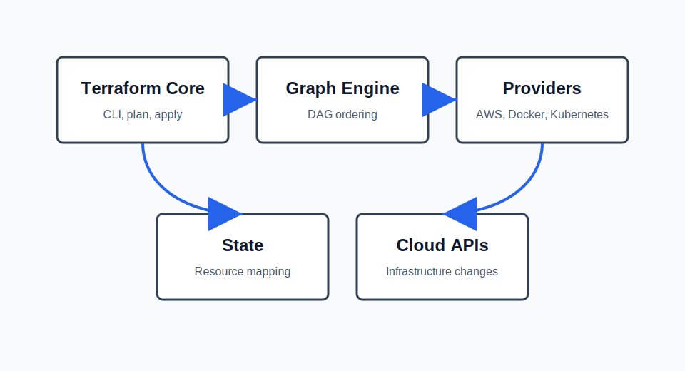

# Terraform Architecture

This module explains the main moving parts behind Terraform and how they work together during an infrastructure change.



## Terraform Core

Terraform Core is the command-line engine that reads configuration files, loads input variables, builds an execution plan, and writes the final result to state. It is responsible for the workflow used in every lab:

```bash
terraform init
terraform plan
terraform apply
terraform destroy
```

Core does not talk directly to cloud APIs. Instead, it coordinates providers through a plugin protocol and decides what must be created, updated, replaced, or deleted.

## Providers

Providers are plugins that translate Terraform resource definitions into API calls for a target platform such as AWS, Kubernetes, Docker, or LocalStack. A provider exposes:

- Resource types such as `aws_vpc`, `aws_instance`, and `aws_s3_bucket`
- Data sources such as `aws_ami` or `aws_availability_zones`
- Authentication and endpoint configuration

In AWS labs, the provider is configured with a region variable so the same code can run in different regions without changing the provider block.

## State

Terraform state maps configuration resources to real infrastructure objects. Without state, Terraform would not know which existing VPC, EC2 instance, or S3 bucket belongs to the current configuration.

State stores:

- Resource IDs returned by providers
- Dependency metadata
- Output values
- Current attributes used for drift detection

State can be local for learning labs or remote for team usage. Remote state usually adds locking to prevent concurrent changes.

## DAG and Graph Engine

Terraform builds a directed acyclic graph (DAG) from resource references and explicit dependencies. This graph tells Terraform the safe order for operations.

For example:

```hcl
resource "aws_subnet" "this" {
  vpc_id = aws_vpc.this.id
}
```

The subnet depends on the VPC because it references `aws_vpc.this.id`. Terraform uses that edge in the graph to create the VPC before the subnet and destroy the subnet before the VPC.

## End-to-End Flow

1. Terraform Core loads `.tf` files and variables.
2. Providers are installed during `terraform init`.
3. Core asks providers to read current infrastructure and compare it with state.
4. The graph engine builds an ordered plan.
5. Providers execute API calls during `terraform apply`.
6. Terraform writes the final resource mapping back to state.

