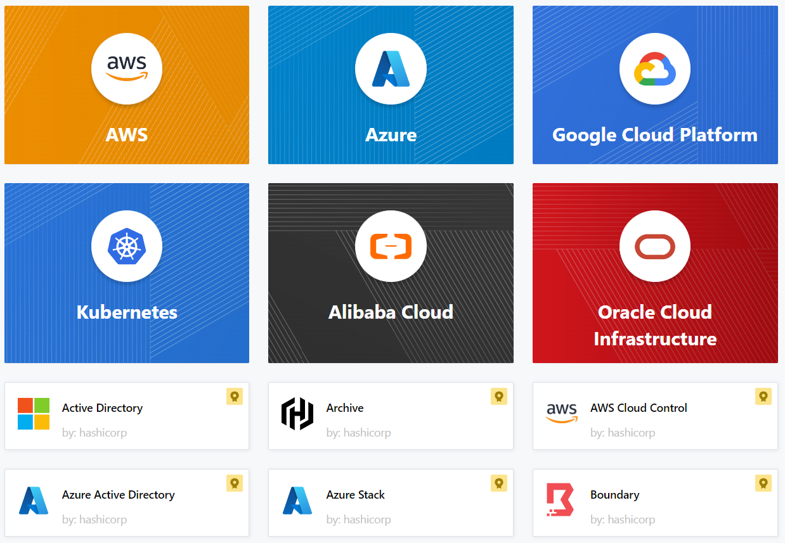

# # Blocs Terraform de Niveau Supérieur

## Vue d'ensemble — arborescence des fichiers


Chaque bloc a son fichier dédié par convention :

| Fichier            | Blocs contenus            | Rôle                                          |
| ------------------ | ------------------------- | --------------------------------------------- |
| `backend.tf`       | `terraform {}`            | Version, providers requis, backend state      |
| `providers.tf`     | `provider {}`             | Configuration du cloud provider               |
| `main.tf`          | `resource {}` `module {}` | Ressources et modules                         |
| `variables.tf`     | `variable {}`             | Paramètres d'entrée                           |
| `outputs.tf`       | `output {}`               | Valeurs exposées en sortie                    |
| `locals.tf`        | `locals {}`               | Variables internes calculées                  |
| `data.tf`          | `data {}`                 | Lecture de données existantes (API)           |
| `terraform.tfvars` | —                         | Valeurs des variables (**ne pas versionner**) |

---

## Exemples HCL — un bloc par type


### Points clés

- **`terraform {}`** — seules des valeurs constantes autorisées (pas de variables, pas de fonctions)
- **`provider {}`** — plusieurs blocs possibles avec `alias` pour multi-région / multi-compte
- **`resource {}`** — syntaxe : `resource "TYPE" "NOM_LOCAL" {}` → référencé via `TYPE.NOM_LOCAL.attribut`
- **`variable {}`** — utilisée via `var.NOM` dans le reste du code
- **`output {}`** — valeur exposée après `terraform apply`, visible dans le state
- **`locals {}`** — calcul interne, utilisé via `local.NOM` (évite la répétition)
- **`data {}`** — lecture seule depuis l'API cloud, référencée via `data.TYPE.NOM.attribut`
- **`module {}`** — groupe de ressources réutilisables (local ou registre public Terraform)

> **Note version** : la contrainte `~> 0.14.3` du README original est obsolète. Utiliser `~> 1.14` pour Terraform 1.14.x (version actuelle stable).


### 

### Exemple:

- Ce bloc est généralement défini au début du fichier de configuration Terraform, souvent nommé ***backend.tf***, et est encadré par la syntaxe ***terraform {}***

- Exemple
  
  ```hcl
  terraform {
  required_version = "~> 0.14.7"
  required_providers {
      aws = {
          source = "hashicorp/aws"
          version = "~> 5.0"
      }
  }
  backend "s3" {
      bucket = "my-tf-state-bucket"
      key    = "path/to/my/key"
  }
  }
  ```
  
    Dans cet exemple :
  
  - **required_version** :
    
    - Spécifie la version minimale requise de Terraform pour votre configuration. Vous pouvez utiliser des contraintes de version pour garantir la compatibilité.
    - *~> 0.14.3* : Signifie toute version supérieure ou égale à 0.14.7 mais inférieure à la prochaine version significative (0.15.0).
    - Plus de détails ici : [https://developer.hashicorp.com/terraform/language/expressions/version-constraints](https://developer.hashicorp.com/terraform/language/expressions/version-constraints)
  
  - **required_providers** :
    
    - Spécifie les exigences du provider
    - **aws** : *aws dans `aws = { ... }`* est un nom local, il peut s'agir de n'importe quel nom de votre choix, ex : *myaws*, *awscloud*. Le nom local préféré est le namespace (*hashicorp/**aws***)
    - Le nom local (*aws, myaws, awscloud*) que vous indiquez dans **required_providers** est le nom que vous devrez utiliser dans la section **provider** par la suite
    - Plus de détails ici : [https://registry.terraform.io/providers/hashicorp/aws/latest/docs](https://registry.terraform.io/providers/hashicorp/aws/latest/docs)
  
  - **backend** :
    
    - Spécifie la configuration du backend pour le stockage distant du state.
    - Dans ce cas, il est configuré pour utiliser un bucket S3 comme backend, avec le nom du bucket et la clé.

### **Provider Block**



- Le provider block est utilisé pour **configurer le provider nommé**,
  
  - exemple : *aws, azure(azurerm), GCP(google), kubernetes*, etc

- Le **Terraform Provider Block** est utilisé pour **définir et configurer la plateforme cloud ou d'infrastructure pour gérer les resources**

- Les providers **agissent comme des plugins permettant à Terraform d'interagir avec les APIs des cloud providers**.

- Un provider est **responsable de la création et de la gestion des resources**.

- Par défaut, les providers ne sont pas installés avec Terraform (c'est juste un fichier exe), mais lorsque vous exécutez la commande '*terraform init*', les plugins pour les providers sont téléchargés.

- Plusieurs provider blocks peuvent coexister si une configuration Terraform est composée de plusieurs providers, ce qui est une situation courante.

- Exemple - Provider Block AWS :
  
  ```hcl
  provider "aws" {
  region = "us-east-1"
  }
  ```
  
    Dans cet exemple :
  
  - **provider** : Le **mot-clé** pour démarrer le provider block.
  - **aws** : Le **nom du provider**. Dans ce cas, il s'agit du provider AWS.
  - **region = "us-east-1"** : Paramètres de configuration du provider. Ici, il **spécifie la région AWS** comme *us-east-1* et toutes les ressources AWS seront configurées et gérées dans cette région AWS.

- Plus de détails ici :
  
  - [https://registry.terraform.io/browse/providers](https://registry.terraform.io/browse/providers)
  - [https://www.terraform.io/language/providers](https://www.terraform.io/language/providers )
  - [https://www.terraform.io/docs/providers/index.html](https://www.terraform.io/docs/providers/index.html)
  - [https://registry.terraform.io/browse/providers](https://registry.terraform.io/browse/providers)
