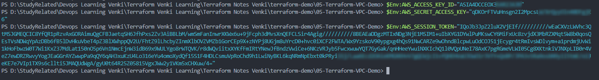

# Démonstration VPC Terraform

**À FAIRE :** exécuter les commandes terraform pour créer un **VPC** avec * vpc.tf* et mettre à jour la documentation des commandes avec des captures d'écran

### Étape 01 : Créer un fichier 00_provider.tf pour inclure les blocs terraform et provider

```hcl
terraform {
  required_providers {
    aws = {
    source = "hashicorp/aws"
    version = "~> 5.0"
    }
  }
}

provider "aws" {
    region = "us-east-1"

    default_tags {
      tags = {
        terraform = "yes"
        project = "terraform-learning"
      }
    }
}
```

[00_provider.tf](00_provider.tf)

### Étape 02 : Créer un fichier 01_vpc.tf avec un resource block pour créer un VPC AWS

- [Resource Terraform AWS VPC](https://registry.terraform.io/providers/hashicorp/aws/latest/docs/resources/vpc)
  
  ```hcl
  resource "aws_vpc" "appvpc" {
      cidr_block = "10.0.0.0/16"
  
      tags = {
        Name = "myapp-vpc"
      }
  }
  ```

[01_vpc.tf](01_vpc.tf)

### Étape 03 : S'authentifier auprès d'AWS via les Credentials IAM

- [Types d'Authentification AWS Terraform](https://registry.terraform.io/providers/hashicorp/aws/latest/docs#authentication)
  
  - **Static Credentials** - Utilisable dans la section *provider*, mais ce n'est PAS UNE OPTION RECOMMANDÉE
  - **Variables d'environnement** - Option recommandée (exemple ci-dessous)
  - **Credentials IAM** stockés localement (fichier de configuration $HOME/.aws/credentials)
    - Utilisez *`aws configure`* pour configurer les credentials AWS

- Exemple : Utilisation des **variables d'environnement** via PowerShell
  
  - 

### Étape 04 : Exécuter les Commandes Terraform

#### Initialiser Terraform

  *`terraform init`*

#### Valider les Fichiers de Configuration Terraform

  *`terraform validate`*

#### Exécuter le Plan Terraform

  *`terraform plan`*

#### Déployer les Resources AWS

  *`terraform apply`*
  ou
  *`terraform apply -auto-approve`* (pour éviter la confirmation) NON Recommandé pour les débutants

### Étape 05 : Nettoyage

#### Détruire les Resources Terraform

  *`terraform destroy`*
  ou
  *`terraform destroy -auto-approve`* (pour éviter la confirmation) NON Recommandé pour les débutants

#### Supprimer les Fichiers Terraform du répertoire courant

##### Linux

  *`rm -rf .terraform*`*
  *`rm -rf terraform.tfstate*`*

##### Windows :

  Supprimer le fichier de lock *.terraform** et le state file *terraform.tfstate* du dossier

## Références

- [Terraform Providers](https://www.terraform.io/docs/configuration/providers.html)
- [Documentation du Provider AWS](https://registry.terraform.io/providers/hashicorp/aws/latest/docs)
- [Resource Terraform AWS VPC](https://registry.terraform.io/providers/hashicorp/aws/latest/docs/resources/vpc)
