# Resource Terraform

- Une **Resource Terraform** est une unité fondamentale utilisée pour modéliser et gérer des composants d'infrastructure.

- Chaque resource block décrit un ou plusieurs ***objets d'infrastructure*** que vous souhaitez créer, modifier ou gérer.
  
  - Exemple : ***bucket S3***, ***instance EC2***, ***instance RDS***, ***Security Group***, ***VPC***

- [**Syntaxe d'une resource**](https://developer.hashicorp.com/terraform/language/resources/syntax)
  
  ```hcl
  resource "type" "nom" {
      argument1 = "valeur1"
      argument2 = "valeur2"
      ......... = "......"
      ......... = "......"
      argumentn = "valeurn"
  }
  ```

- **Exemple d'un Resource Block :**
  
  ```hcl
  resource "aws_instance" "example" {
  ami           = "ami-0c55b159cbfafe1f0"
  instance_type = "t2.micro"
  
  tags = {
  Name = "Linux"
  }
  
  }
  ```
  
    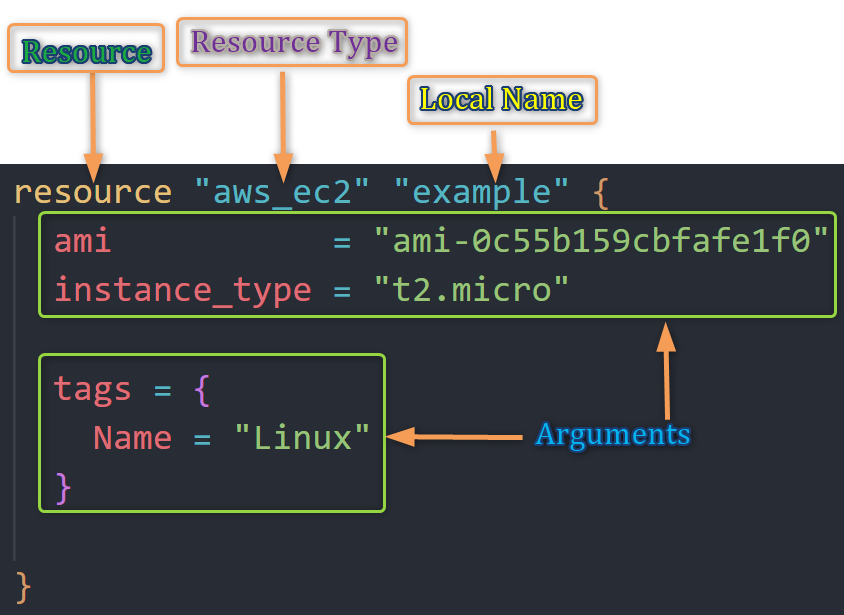
  
  - **`resource` :** Le mot-clé pour démarrer un bloc ***resource***.
  - **`aws_instance` :**
    - Le **type de resource**, qui définit ce que vous créez (ex : une instance EC2 AWS).
    - Le type de resource détermine le type d'objet d'infrastructure qu'il gère, ainsi que les arguments et autres attributes supportés
  - **`example`** :
    - Le **nom de la resource**, qui est un identifiant unique dans votre configuration.
    - C'est un nom local ("example").
    - Le nom est utilisé pour référencer cette resource ailleurs dans le même module Terraform, mais n'a aucune signification en dehors de la portée de ce module.
  - **`ami`, `instance_type` et `tags` :** Arguments ou paramètres de configuration spécifiques à la resource que vous définissez.

## Comportements des Resources Terraform

Les comportements des resources Terraform concernent :

- La façon dont Terraform gère et interagit avec les resources de votre infrastructure.

- Ces comportements déterminent comment les resources sont
  
  - ***créées***
  - ***détruites***
  - ***mises à jour***
1. ***Créer*** :
   
   - Terraform tente de **créer des resources** dans votre infrastructure cible selon votre configuration.
   - Terraform ***crée* des resources** qui existent dans la configuration mais ne sont pas associées (présentes) à un objet d'infrastructure réel dans le state

2. ***Détruire*** :
   
   - ***Détruit* des resources** qui existent dans le state/l'infra mais n'existent plus dans la configuration.
   - Supprimer une resource de votre configuration Terraform entraîne la destruction planifiée de cette resource dans l'infrastructure.

3. ***Mise à jour en place*** :
   
   - ***Met à jour* les resources** dont les arguments ont changé
   - Terraform détecte les différences entre l'état désiré dans votre configuration et l'état courant dans l'infrastructure. Il planifie et applique les changements pour mettre à jour les resources en conséquence.

4. ***Destruction et recréation*** :
   
   - Terraform va ***détruire et recréer* les resources** dont les arguments ont changé mais qui ne peuvent pas être mis à jour en place en raison des limitations de l'API distante
   - Exemple : Modifier la Availability Zone d'une instance EC2 AWS

5. ***Gestion des Dépendances*** :
   
   - Terraform s'assure que les resources dépendantes sont créées ou mises à jour avant les resources qui en dépendent, pour éviter les problèmes.

6. ***Contrôle de la Concurrence*** :
   
   - Terraform gère la concurrence des opérations sur les resources pour prévenir les conflits et garantir la cohérence.

7. ***Gestion du State*** :
   
   - Terraform maintient un state file qui enregistre l'état courant de l'infrastructure, utilisé pour planifier et appliquer les mises à jour.

### Comprendre le Comportement des Resources Terraform avec un Exemple

- Créons une instance EC2 AWS et comprenons le comportement de la Resource Terraform (EC2)
  
  1. Créer le bloc **provider** Terraform
     
     ```hcl
     terraform {
     required_providers {
         aws = {
             source = "hashicorp/aws"
             version = "~-> 5.0"
         }
     }
     }
     
     provider "aws" {
         region = "us-east-1"
     
         default_tags {
             tags = {
             terraform = "yes"
             project = "terraform-learning"
             }
         }
     }
     ```
  
  2. Créer le bloc **Resource (EC2)**
     
     ```hcl
     resource "aws_instance" "example" {
     ami           = "ami-0df435f331839b2d6"
     instance_type = "t2.micro"
     
     tags = {
         Name = "Linux2023"
         Owner = "Venkatesh"
     }
     }
     ```

- Exécutons les commandes Terraform pour comprendre le comportement des resources
  
  1. ***`terraform init`*** : *Initialiser* terraform
     
     - La commande `terraform init` est utilisée pour **initialiser une configuration Terraform**.
     - Elle configure les composants et dépendances nécessaires pour que Terraform gère votre infrastructure.
         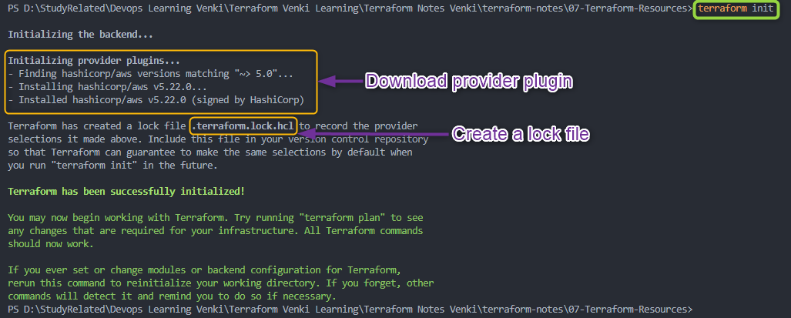
     - **Téléchargement des Providers et Modules :** Lors de l'exécution de `terraform init`, Terraform télécharge le plugin pour le provider (dans notre cas AWS) dans le dossier ***.terraform*** du répertoire courant
         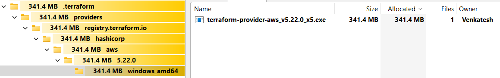
     - **Verrouillage et Suivi des Dépendances :** Terraform crée également un fichier ***terraform.lock.hcl*** pour suivre les versions des providers et des modules.
         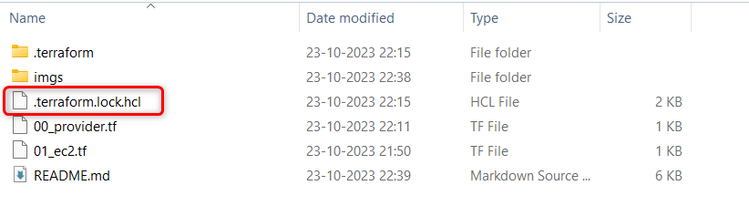
  
  2. ***`terraform validate`*** : *Valider* le code terraform
     
     - **Valide les fichiers de configuration** dans un répertoire
     - Validate effectue des vérifications pour s'assurer qu'une configuration est **syntaxiquement valide et cohérente en interne**
     - Principalement utile pour la vérification générale des modules réutilisables, notamment la correction des noms d'attributs et des types de valeurs.
     - Il est **sûr d'exécuter cette commande** automatiquement
     - La validation **nécessite un répertoire de travail initialisé** (*terraform init*) avec tous les plugins et modules référencés installés
     - Exemple :
       - terraform validate avec des messages d'erreur à corriger
         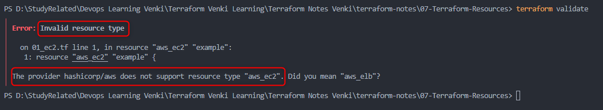
         - Dans le cas ci-dessus, *resource* doit être *`aws_instance`* et non *`aws_ec2`*, donc *`terraform validate`* affichera une erreur
       - terraform validate sans erreurs
         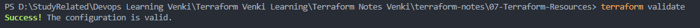
  
  3. ***`terraform fmt`*** : *Formater* le code terraform
     
     - La commande `terraform fmt` est utilisée pour **formater automatiquement les fichiers de configuration Terraform**, favorisant un style de code cohérent et une meilleure lisibilité.
     
     - **Formatage :** Elle standardise l'indentation, les sauts de ligne et l'ordonnancement des éléments dans vos fichiers de configuration.
     
     - **Règles de Syntaxe :** Applique les règles de syntaxe Terraform, garantissant une indentation et un formatage appropriés
     
     - **Commentaires :** Ne modifie pas les commentaires mais s'assure qu'ils sont formatés de manière cohérente.
     
     - Elle reformate les fichiers sans modifier le contenu ni la fonctionnalité de votre configuration et il est **sûr d'exécuter la commande à tout moment**
     
     - Lorsque *`terraform fmt`* est exécuté, il liste les fichiers qu'il a formatés ; si aucun fichier n'est listé, cela signifie que tous les fichiers sont bien formatés.
         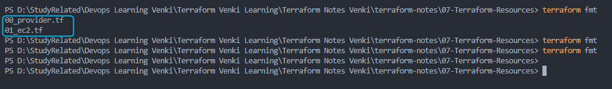
     4. ***`terraform plan`*** : *Réviser* le plan terraform
        - La commande `terraform plan` est utilisée pour **créer un plan d'exécution** pour votre configuration Terraform, **montrant les changements que Terraform apportera** à votre infrastructure.
        - **Planifier les Changements d'Infrastructure :** Compare l'état courant de votre infrastructure avec l'état désiré et planifie les changements nécessaires.
        - **Résumé de Sortie :** **Fournit un résumé lisible des changements planifiés**, incluant la **création, la modification** et la **destruction** de resources.
        - **Informations Détaillées :** Offre des informations détaillées sur les changements planifiés, les modifications de resources et les dépendances.
        - **Validation :** Valide (*`terraform validate`*) votre configuration pour détecter les erreurs de syntaxe et les incohérences avant d'appliquer les changements.
        - **Dry Run :** `terraform plan` est une commande de "dry run" ; elle **montre les changements proposés sans les appliquer**.
        - Il est **sûr d'exécuter** cette commande
        - `terraform plan` nécessite que vos [Credentials AWS](https://registry.terraform.io/providers/hashicorp/aws/latest/docs#authentication) soient configurés et que vous puissiez vous connecter/accéder à votre infrastructure AWS. Vous recevrez l'erreur ci-dessous si les credentials AWS ne sont pas configurés
            *Error: No valid credential sources found*
            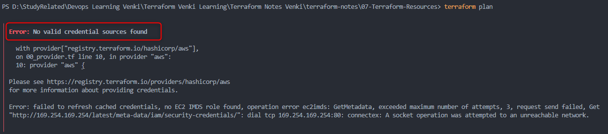
        - Configurez vos [Credentials AWS](https://registry.terraform.io/providers/hashicorp/aws/latest/docs#authentication) selon la méthode de votre choix
            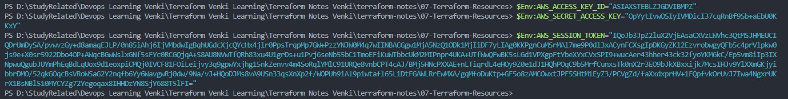
        - Exemple de `terraform plan`
            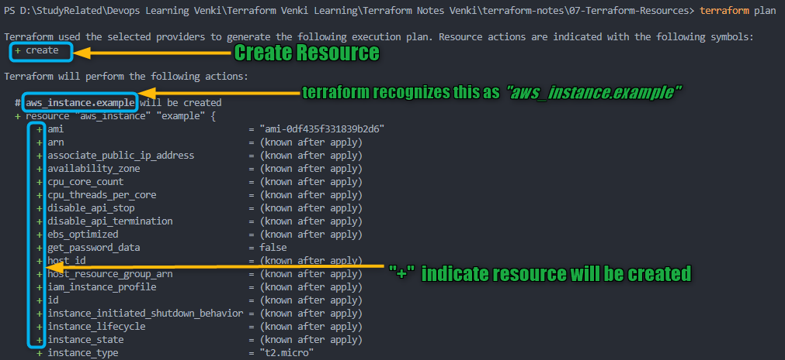
            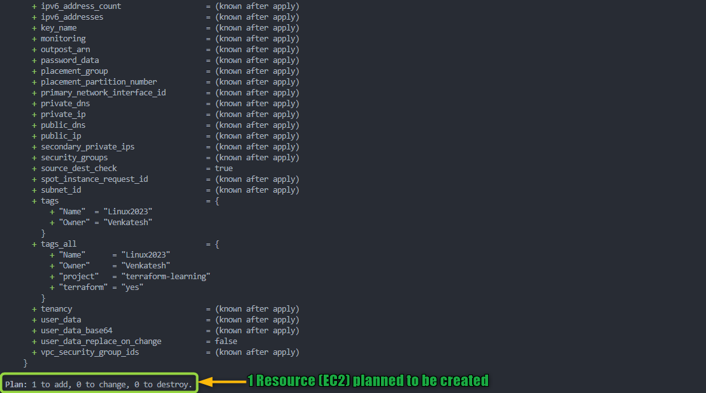***`terraform apply`*** : *Créer* des Resources avec terraform
              - *`terraform apply`* c'est comme appuyer sur le bouton "**exécuter**" de votre configuration Terraform.
              - Il indique à Terraform de **créer, mettre à jour ou supprimer des resources dans votre infrastructure** selon votre configuration.
              - Soyez très prudent avant de valider la commande *`terraform apply`* car elle modifie votre infrastructure
              - Comprendre *`terraform apply`* plus en détail :
                  1. **Exécution :** Terraform **analyse** votre configuration et l'état courant de votre infrastructure pour **identifier les différences entre l'état désiré et l'état réel**.
          
                  2. **Changements :** Terraform agit pour **faire correspondre l'état réel à l'état désiré**, ce qui peut impliquer la **création, la mise à jour ou la suppression de resources**.
          
                  3. **Confirmation Utilisateur :** Avant d'effectuer des changements, Terraform vous montre un résumé de ce qu'il va faire. Peut être contourné avec *auto-approve*
          
                  4. **Approbation Utilisateur :** Vous devez confirmer en tapant "***yes***" lorsque vous êtes invité, pour vous assurer d'être conscient des changements.
          
                  5. **Exécution :** Une fois confirmé, Terraform exécute les changements, et vous pouvez voir la progression en temps réel.
          
                  6. **Achèvement :** Après avoir appliqué les changements, Terraform **fournit un résumé de ce qui a été créé, mis à jour ou supprimé**. Il met également à jour le state file avec l'état courant de votre infrastructure.
              - Exemple de *`terraform apply`*
                  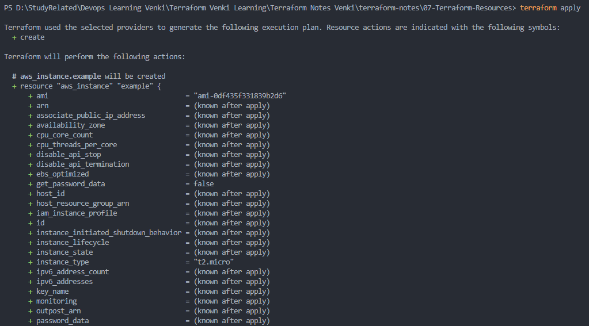
                  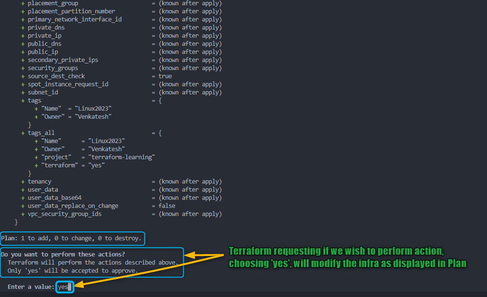
          
              - Après avoir tapé ***yes*** à l'invite de *`terraform apply`*, terraform commencera à **créer** les resources mentionnées dans le *plan*
                  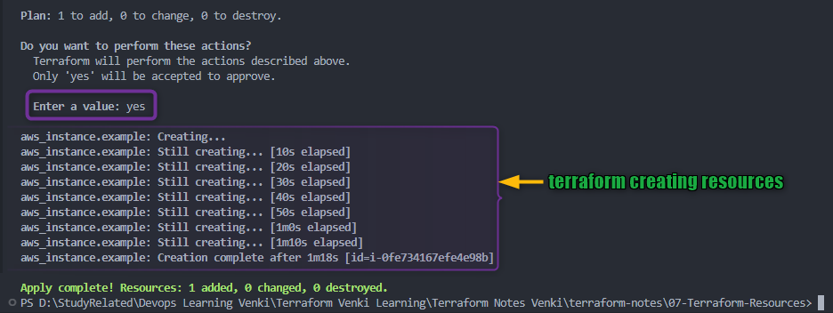
              - Vous devriez également pouvoir vérifier sur votre Console AWS la resource (EC2) en cours de création
                  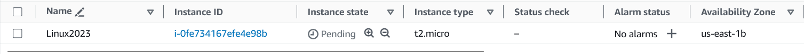
              - Une fois l'exécution de terraform terminée, vous devriez pouvoir vérifier sur votre Console AWS la resource (EC2) créée avec succès.
                  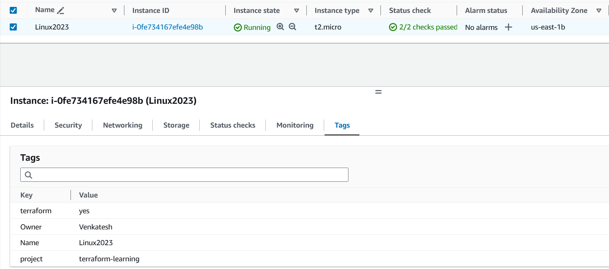
          
          
          ***`terraform destroy`*** : *Détruire ou supprimer* des Resources
              - `terraform destroy` c'est comme le bouton "**arrêt**" de votre infrastructure gérée par Terraform.
              - Il indique à Terraform de **démanteler et supprimer toutes les resources** de votre infrastructure créées ou gérées par Terraform.
              - Comprendre *`terraform destroy`* plus en détail :
                  1. **Exécution :** Terraform analyse votre configuration et l'état courant de votre infrastructure, comme pour `terraform apply`.
                  2. **Destruction des Resources :** Cependant, au lieu de créer ou mettre à jour des resources, `terraform destroy` se concentre sur leur **destruction et suppression**.
                  3. **Confirmation Utilisateur :** Comme pour `terraform apply`, il vous montre un résumé de ce qu'il va détruire. Peut être contourné avec *auto-approve*.
                  4. **Approbation Utilisateur :** Vous devez confirmer en tapant "***yes***" lorsque vous êtes invité, pour vous assurer d'être conscient des resources qui vont être supprimées.
                  5. **Exécution :** Une fois confirmé, Terraform exécute la destruction, et vous pouvez voir la progression en temps réel.
                  6. **Achèvement :** Après la destruction des resources, Terraform **fournit un résumé de ce qui a été supprimé**.
          
             - Exemple de *`terraform destroy`*
                  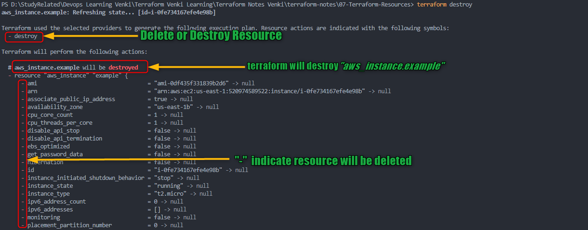
                  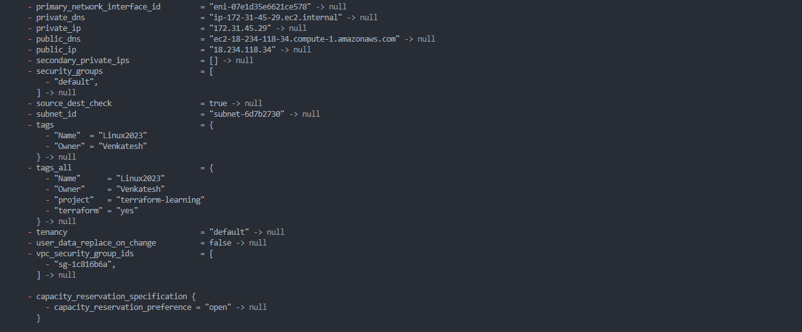
                  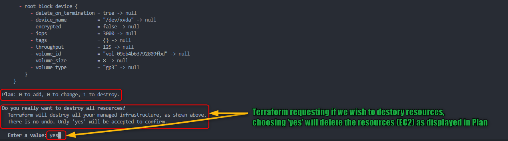
          
              - Après avoir tapé ***yes*** à l'invite de *`terraform destroy`*, terraform commencera à **détruire** les resources mentionnées dans le *plan*
                  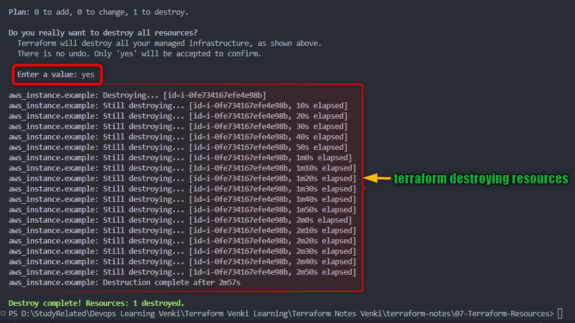
              - Vous devriez également pouvoir vérifier sur votre Console AWS la resource (EC2) en cours d'arrêt et de préparation à la résiliation
                  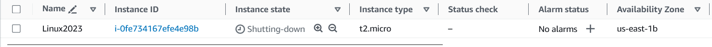
              - Une fois l'exécution de terraform terminée, vous devriez pouvoir vérifier sur votre Console AWS la resource (EC2) résiliée avec succès.
                  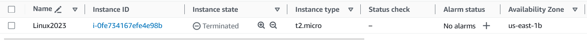

- ### ***`terraform apply -auto-approve`*** et ***`terraform destroy -auto-approve`***
  - L'option *-auto-approve* peut être ajoutée à la commande terraform apply pour ignorer l'étape de confirmation.
  - Lorsque vous utilisez *`terraform apply -auto-approve`* ou *`terraform destroy -auto-approve`*, **Terraform ne demandera pas votre confirmation et appliquera immédiatement** les changements décrits dans le plan d'exécution.
  - Cela peut être **utile pour l'automatisation, les scripts ou les pipelines CI/CD** où la confirmation manuelle n'est pas possible
  - Cependant, **soyez prudent lorsque vous utilisez *-auto-approve* dans les environnements de production**, car cela peut entraîner des changements non souhaités si le plan d'exécution n'est pas soigneusement révisé.
  - **Révisez toujours soigneusement le plan d'exécution avant d'utiliser *-auto-approve*** pour vous assurer que les changements sont conformes aux attentes et ne causeront pas de problèmes dans votre infrastructure.
     

- [Syntaxe des Resources](https://developer.hashicorp.com/terraform/language/resources/syntax)
- [Comportement des Resources](https://developer.hashicorp.com/terraform/language/resources/behavior)
- [Provisionner une Infrastructure avec Terraform](https://developer.hashicorp.com/terraform/cli/run)
