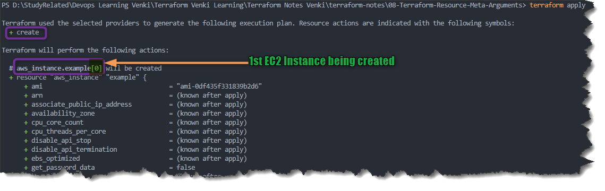
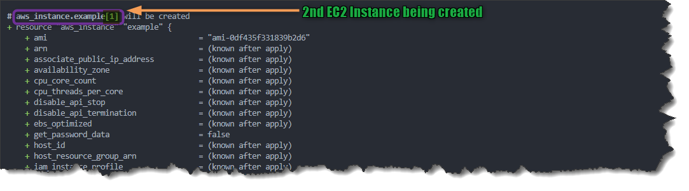
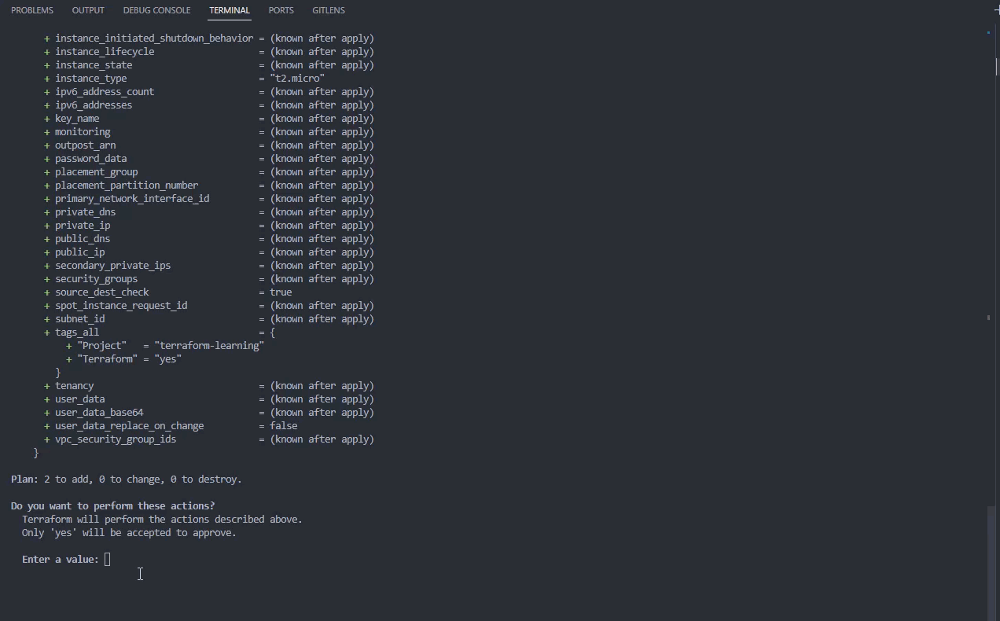
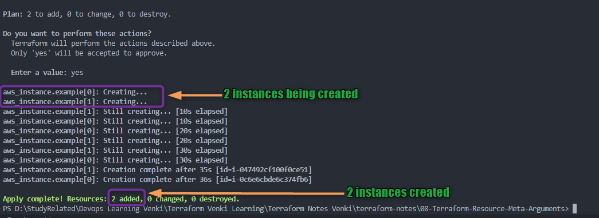
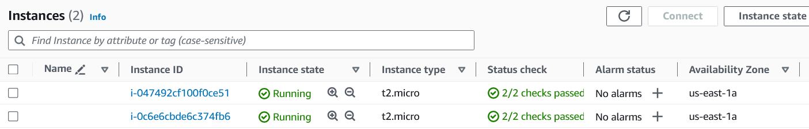
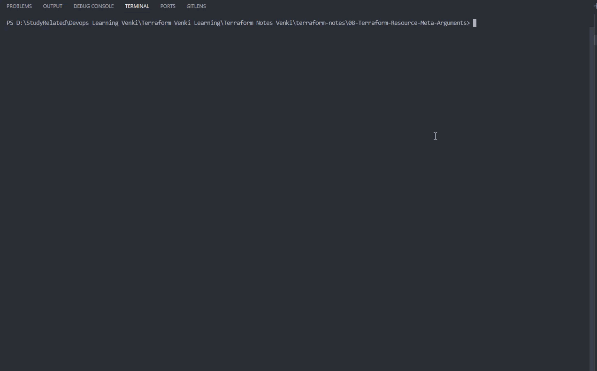
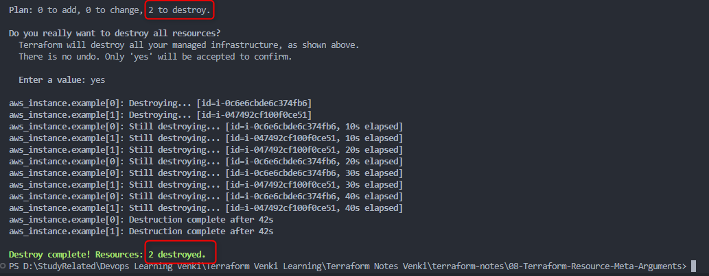
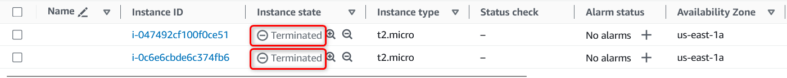

## Meta-Argument Terraform : *`count`*

### Meta-Argument ***`count`***

- Le meta-argument ***count*** vous permet de **spécifier le nombre d'instances d'une resource que vous souhaitez créer**.

- ***count*** est utilisé lorsque vous **avez besoin de plusieurs resources identiques avec la même configuration**.

- ***count*** peut être utilisé avec les **modules** et avec **tous les types de resources**

- L'argument ***count*** **doit être un nombre entier non négatif**.

- Si ***count*** est **défini à 0**, il **ne créera aucune instance de la resource**.

- Vous pouvez également **utiliser des expressions** pour déterminer le count de manière dynamique.

- Lorsque chaque instance est créée, elle possède son propre objet d'infrastructure distinct, ainsi **chacune peut être gérée séparément**. Lorsque la configuration est appliquée, chaque objet peut être créé, détruit ou mis à jour selon les besoins.

- ***`count.index`***
  
  - ***count.index*** est une variable spéciale utilisée conjointement avec le meta-argument *count*.
  - ***count.index*** vous permet d'accéder à l'index courant d'une instance de resource dans un bloc count.
  - Cela peut être particulièrement utile lorsque vous avez besoin de configurations de resources uniques ou qui dépendent de leur position dans la liste des instances créées par count.

- **Remarque** : Un **bloc de resource ou de module donné ne peut pas utiliser à la fois ***count***** et ***for_each*** .

- **Exemple** :
    [00_provider.tf](./00_provider.tf)
  
  ```hcl
  terraform {
  required_providers {
      aws = {
          source = "hashicorp/aws"
          version = "~> 5.0"
      }
  }
  }
  
  provider "aws" {
      region = "us-east-1"
  
      default_tags {
      tags = {
          Terraform = "yes"
          Project = "terraform-learning"
      }
      }
  }
  ```
  
    [01_ec2.tf](./01_ec2.tf)
  
  ```hcl
  resource "aws_instance" "example" {
      count = 2 # Utilisation du meta-argument pour créer 2 instances EC2 identiques
      ami           = "ami-0df435f331839b2d6"
      instance_type = "t2.micro"
  }
  ```

- Exécutons les commandes Terraform pour comprendre le comportement des resources
  
  1. ***`terraform init`*** : *Initialiser* terraform
  
  2. ***`terraform validate`*** : *Valider* le code terraform
  
  3. ***`terraform fmt`*** : *Formater* le code terraform
  
  4. ***`terraform plan`*** : *Réviser* le plan terraform
  
  5. ***`terraform apply`*** : *Créer* des Resources avec terraform
     
     - Exemple de *`terraform apply`*
         
         
     
     - Après avoir tapé ***yes*** à l'invite de *`terraform apply`*, terraform commencera à **créer** les resources.
         
         
     
     - Une fois l'exécution de terraform terminée, vous devriez pouvoir vérifier sur votre Console AWS 2 instances EC2 créées avec succès
         
  
  6. ***`terraform destroy`*** : *Détruire ou supprimer* des Resources, Nettoyer les resources créées
     
     - Après avoir tapé ***yes*** à l'invite de *`terraform destroy`*, terraform commencera à **détruire** les resources
       
       
       

        - Une fois l'exécution de terraform terminée, vous devriez pouvoir vérifier sur votre Console AWS que les deux EC2 ont été résiliés avec succès.
        

- #### ***`count.index`***
  
  - Exemple de code pour ***count.index***
    
    ```hcl
    resource "aws_instance" "example" {
    count         = 2
    ami           = "ami-0df435f331839b2d6"
    instance_type = "t2.micro"
    
    tags = {
        Name = "Instance-${count.index + 1}"
    }
    }
    ```
  
  - Dans cet exemple, nous créons deux instances EC2 AWS avec le même AMI et le même type d'instance. Cependant, le bloc tags utilise *count.index* pour définir un tag Name unique pour chaque instance. En ajoutant 1 à *count.index*, nous nous assurons que les noms des instances sont "Instance-1" et "Instance-2".
  
  - Remarques : *count.index* est un index à base zéro, ce qui signifie qu'il commence à 0. Vous pouvez l'utiliser pour créer des configurations de resources dynamiques et uniques pour chaque instance créée avec count.

- Références :
  
  - [Le Meta-Argument count](https://developer.hashicorp.com/terraform/language/meta-arguments/count)
