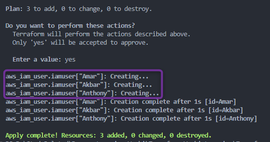
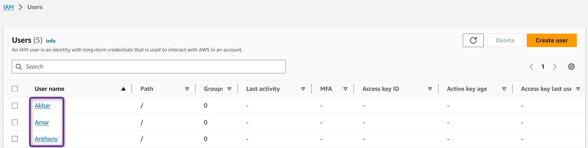

##  Meta-Arguments de Resources Terraform

2. ### Meta-Argument ***`for_each`***

- **Exemple** : ***`set`***

    [00_provider.tf](./00_provider.tf)
    ```hcl
    terraform {
    required_providers {
        aws = {
            source = "hashicorp/aws"
            version = "~> 5.0"
        }
    }
    }

    provider "aws" {
        region = "us-east-1"

        default_tags {
        tags = {
            Terraform = "yes"
            Project = "terraform-learning"
        }
        }
    }
    ```

    [01_iam.tf](./01_iam.tf)
    ```hcl
    # Créer 3 utilisateurs IAM avec un seul resource block
    # https://registry.terraform.io/providers/hashicorp/aws/latest/docs/resources/iam_user

    resource "aws_iam_user" "iamuser" {
    for_each = toset(["Amar", "Akbar", "Anthony", "Amar"]) # Bien qu'Amar soit défini deux fois, le set supprime le doublon
    name     = each.key

    tags = {
        Name = each.key
        # Name = each.value # avec un set, each.key == each.value, on peut utiliser l'un ou l'autre.
    }
    }

    # ce qui précède peut également être écrit avec une map

    # resource "aws_iam_user" "iamuser" {
    #   for_each = {
    #     Amar  = null
    #     Akbar  = null
    #     Anthony  = null
    #   }

    #   name = each.key

    #   tags = {
    #     Name = each.key
    #   }
    # }
    ```

- Exécutons les commandes Terraform pour comprendre le comportement des resources

    1. ***`terraform init`*** : *Initialiser* terraform
    2. ***`terraform validate`*** : *Valider* le code terraform
    3. ***`terraform fmt`*** : *Formater* le code terraform
    4. ***`terraform plan`*** : *Réviser* le plan terraform
    5. ***`terraform apply`*** : *Créer* des Resources avec terraform

        

        - Une fois l'exécution de terraform terminée, vous devriez pouvoir vérifier sur votre Console AWS que les resources ont été créées avec succès.
            

    6. ***`terraform destroy`*** : *Détruire ou supprimer* des Resources, Nettoyer les resources créées
        - Après avoir tapé ***yes*** à l'invite de *`terraform destroy`*, terraform commencera à **détruire** les resources

        - Une fois l'exécution de terraform terminée, vous devriez pouvoir vérifier sur votre Console AWS que les resources ont été supprimées avec succès.
