## Meta-Argument Terraform : *`for_each`*

### Meta-Argument ***`for_each`***

- Le meta-argument ***for_each*** est utilisé pour **créer plusieurs instances d'une resource à partir des éléments d'une ***`map`*** ou d'un ***`set`*****.
- ***for_each*** offre de la flexibilité pour **gérer des resources avec différentes configurations**.
- Lorsque vous définissez un resource block avec le meta-argument *for_each*, vous pouvez fournir une *`map`* ou un *`set`* qui décrit la configuration de chaque instance de resource.
- Terraform créera alors **une resource distincte pour chaque élément de la map ou du set**

- ***`map`***
    - Une ***map*** est une structure de données qui stocke des ***`paires clé-valeur`***.
    - **Chaque clé dans la map est unique**, et **elle est associée à une valeur spécifique**
    - Exemple :
        ```hcl
        {
            Amar : "98869-12345",
            Akbar    : "98450-56789",
            Anthony    : "94480-54321"
        }
        ```
        - Vous avez des noms (clés) et des numéros de téléphone (valeurs). Chaque nom (clé) est associé à un numéro de téléphone spécifique (valeur).
        - **Les clés d'une map sont uniques**, vous **ne pouvez pas avoir deux entrées avec la même clé**.

- ***`set`***
    - Un *set* est une structure de données qui **stocke une collection d'éléments distincts**.
    - Dans un *set*, **il n'y a pas de doublons**, et **l'ordre des éléments n'a pas d'importance**.
    - Les sets **garantissent automatiquement l'unicité**. Si vous ajoutez un élément qui existe déjà, il ne sera pas dupliqué.
    - Exemple :
        ```hcl
        {"Amar", "Akbar", "Anthony", "Amar"}
        ```
        - Bien que "Amar" soit défini 2 fois, le set le considère comme un seul élément, il ne sera pas dupliqué.

- **Remarque** : Un **bloc de resource ou de module donné ne peut pas utiliser à la fois ***count***** et ***for_each*** .

- **Exemple** : ***`map`***

    [00_provider.tf](./01-for_each-map/00_provider.tf)

    ```hcl
    terraform {
    required_providers {
        aws = {
            source = "hashicorp/aws"
            version = "~> 5.0"
        }
    }
    }

    provider "aws" {
        region = "us-east-1"

        default_tags {
        tags = {
            Terraform = "yes"
            Project = "terraform-learning"
        }
        }
    }
    ```

    [01_s3.tf](./01-for_each-map/01_s3.tf)

    ```hcl
    resource "aws_s3_bucket" "mys3bucket" {
    for_each = {
        dev = "venkat-app-log"
        uat = "venkat-app-log"
        pre = "venkat-app-log"
        prd = "venkat-app-log"
    }
    bucket = "${each.key}-${each.value}"

    tags = {
        Name = "${each.key}-${each.value}"
        Env  = each.key
    }
    }
     ```

- Exécutons les commandes Terraform pour comprendre le comportement des resources

    1. ***`terraform init`*** : *Initialiser* terraform
    2. ***`terraform validate`*** : *Valider* le code terraform
    3. ***`terraform fmt`*** : *Formater* le code terraform
    4. ***`terraform plan`*** : *Réviser* le plan terraform
    5. ***`terraform apply`*** : *Créer* des Resources avec terraform
        - Exemple de *`terraform apply`*
            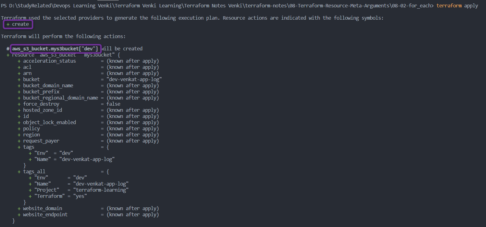
            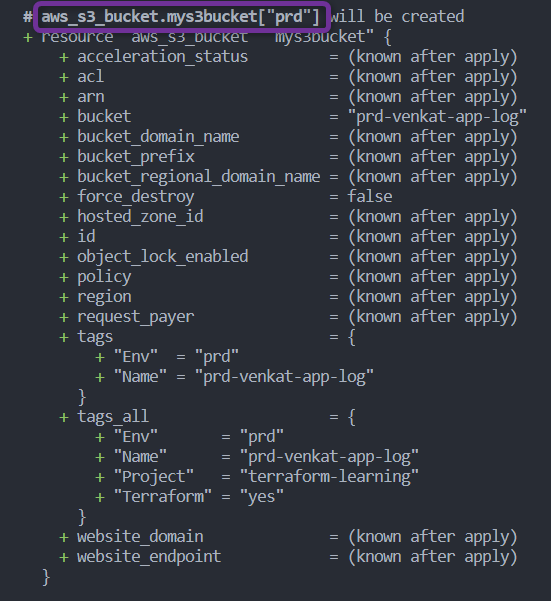
            
            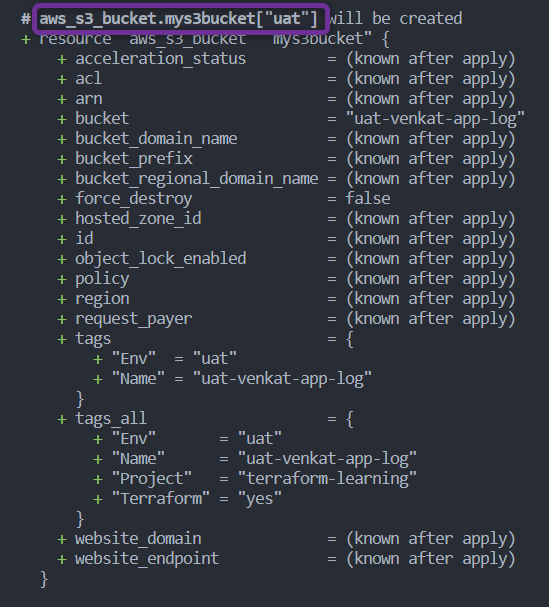

        - Après avoir tapé ***yes*** à l'invite de *`terraform apply`*, terraform commencera à **créer** les resources.
            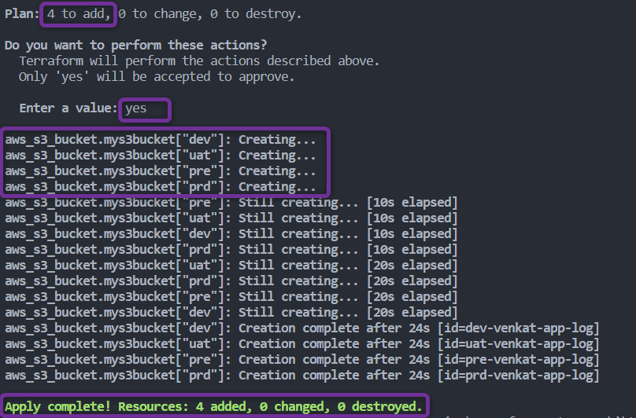

        - Une fois l'exécution de terraform terminée, vous devriez pouvoir vérifier sur votre Console AWS quatre buckets S3 créés avec succès
            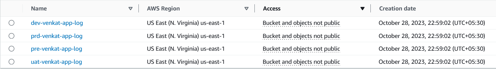

        - Chaque bucket est tagué selon sa ***valeur Env***
            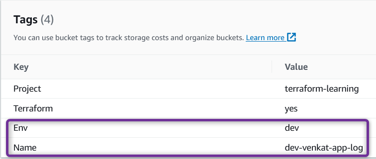
            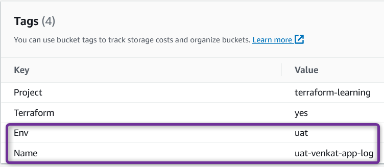
            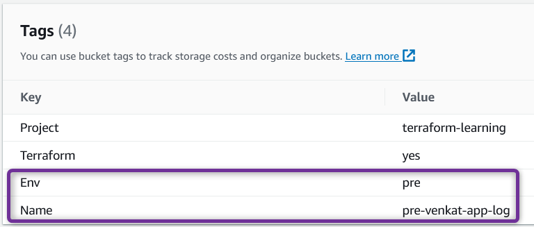
            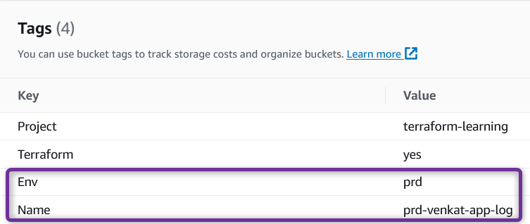


    6. ***`terraform destroy`*** : *Détruire ou supprimer* des Resources, Nettoyer les resources créées
        - Après avoir tapé ***yes*** à l'invite de *`terraform destroy`*, terraform commencera à **détruire** les resources

        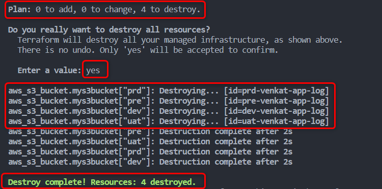


        - Une fois l'exécution de terraform terminée, vous devriez pouvoir vérifier sur votre Console AWS que les deux buckets S3 ont été supprimés avec succès.
        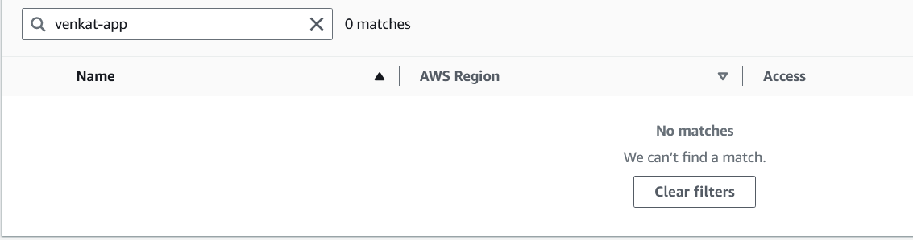

