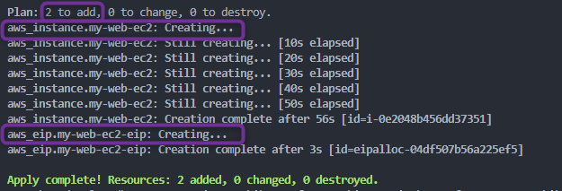
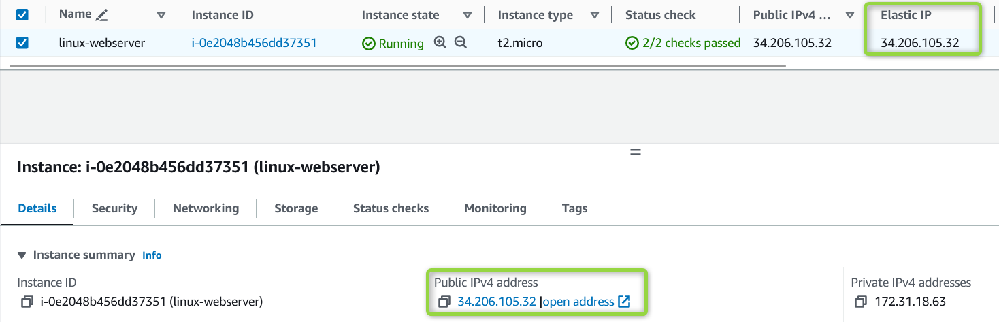
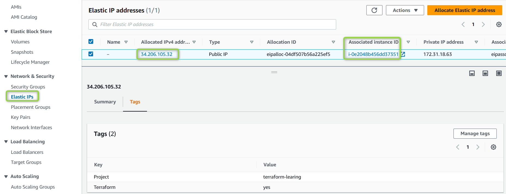

## Meta-Argument Terraform : *`depends_on`*

### Meta-Argument ***`depends_on`***

- Le meta-argument ***depends_on*** dans Terraform est utilisé pour **établir des dépendances ***explicites*** entre des resources**, en spécifiant qu'une resource **dépend de la création ou de la modification réussie d'une autre resource**.

- Lorsque vous définissez *`depends_on`* pour une resource, vous indiquez que **cette resource ne doit être créée ou modifiée qu'après que les resources listées dans *`depends_on`* aient été créées ou modifiées avec succès**.
- Cela est particulièrement utile lorsque vous avez des resources qui nécessitent l'achèvement de certaines tâches avant de pouvoir procéder.

- **Exemple** : Vous pouvez utiliser `depends_on` pour vous assurer qu'une *Elastic IP* n'est assignée à un serveur web EC2 qu'après la création de l'EC2.
        1. Créer *00_provider.tf* pour les providers
        2. Créer une instance EC2 AWS avec le resource block *aws_instance*.
        3. Créer une Elastic IP AWS avec le resource block *aws_eip*.
        4. Utiliser le meta-argument *`depends_on`* dans la resource Elastic IP pour spécifier qu'elle ne doit être associée à l'instance EC2 qu'une fois cette instance créée. Cela garantit que l'Elastic IP est associée à une instance EC2 valide.

    [00_provider.tf](./00_provider.tf)
    ```hcl
    terraform {
    required_version = "~> 1.0"
    required_providers {
        aws = {
        source  = "hashicorp/aws"
        version = "~> 5.0"
        }
    }
    }

    provider "aws" {
    region = "us-east-1"
    default_tags {
        tags = {
        Terraform = "yes"
        Project   = "terraform-learning"
        }
    }
    }
    ```

    [01_ec2.tf](./01_ec2.tf)
    ```hcl
    resource "aws_instance" "my-web-ec2" {
    ami           = "ami-0df435f331839b2d6"
    instance_type = "t2.micro"

    tags = {
        Name  = "linux-webserver"
        Owner = "Venkatesh"
    }
    }
    ```

    [02_eip.tf](./02_eip.tf)
    ```hcl
    # Resource : aws_eip
    # https://registry.terraform.io/providers/hashicorp/aws/latest/docs/resources/eip

    resource "aws_eip" "my-web-ec2-eip" {
    instance   = aws_instance.my-web-ec2.id
    depends_on = [aws_instance.my-web-ec2]
    }
    ```


- Exécutons les commandes Terraform pour comprendre le comportement des resources

    1. ***`terraform init`*** : *Initialiser* terraform
    2. ***`terraform validate`*** : *Valider* le code terraform
    3. ***`terraform fmt`*** : *Formater* le code terraform
    4. ***`terraform plan`*** : *Réviser* le plan terraform
    5. ***`terraform apply`*** : *Créer* des Resources avec terraform
        

    - Une fois l'exécution de terraform terminée, vous devriez pouvoir vérifier sur votre Console AWS que les resources ont été créées avec succès.
        
        


    #### Nettoyage

    6. ***`terraform destroy`*** : *Détruire ou supprimer* des Resources, Nettoyer les resources créées
        - Après avoir tapé ***yes*** à l'invite de *`terraform destroy`*, terraform commencera à **détruire** les resources

        - Une fois l'exécution de terraform terminée, vous devriez pouvoir vérifier sur votre Console AWS que les resources ont été supprimées avec succès.

### Références :

[Resource : aws_eip](https://registry.terraform.io/providers/hashicorp/aws/latest/docs/resources/eip)
[Le Meta-Argument depends_on](https://developer.hashicorp.com/terraform/language/meta-arguments/depends_on)
