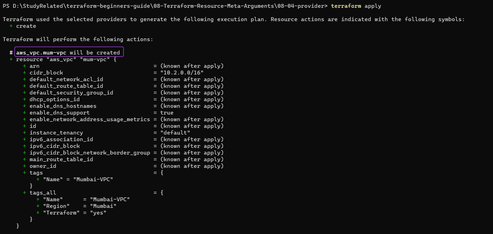
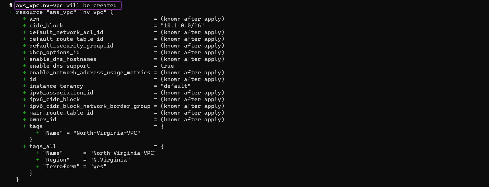
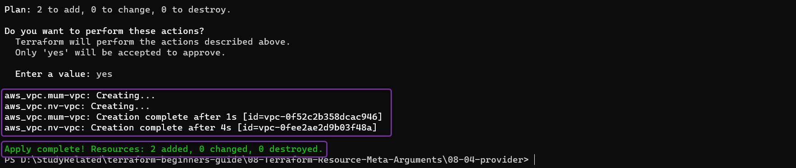
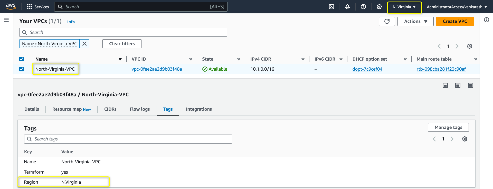
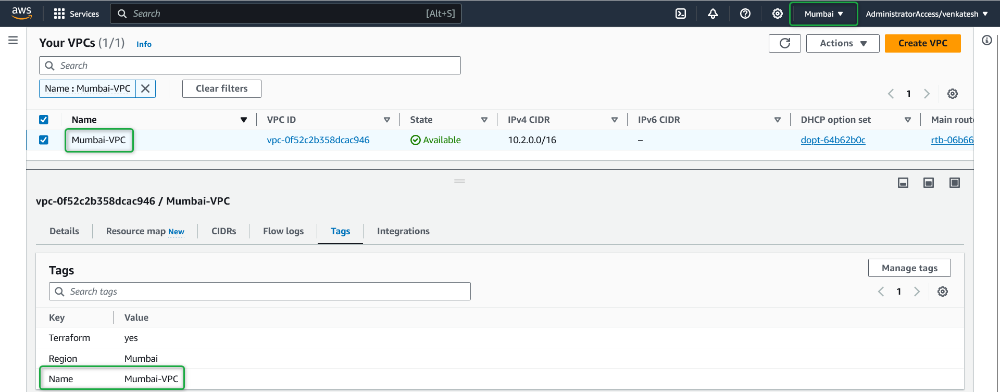

## Meta-Argument Terraform : *`provider`*

### Meta-Argument ***`provider`***

- *`provider`* vous permet d'utiliser plusieurs providers dans Terraform
- Vous pouvez utiliser plusieurs providers au sein de la même configuration pour **gérer des resources dans différentes régions cloud ou chez différents fournisseurs de services**.
- Chaque définition de provider spécifie un ensemble différent de paramètres de configuration, vous permettant d'interagir avec plusieurs environnements.

- **Scénario** : Supposons que vous souhaitiez **créer 2 VPC dans 2 régions différentes**, ou peut-être **lancer des instances EC2 dans 2 régions différentes**.

- **Exemple** :

    [00_provider.tf](./00_provider.tf)

    ```hcl
    terraform {
    required_version = "~> 1.0"
    required_providers {
        aws = {
        source  = "hashicorp/aws"
        version = "~> 5.0"
        }
    }
    }

    # Définir le Premier Provider AWS (us-east-1)
    provider "aws" {
    region = "us-east-1"
    alias  = "us-east-nv"

    default_tags {
        tags = {
        Terraform = "yes"
        Region    = "N.Virginia"
        }
    }
    }

    # Définir le Second Provider AWS (ap-south-1)
    provider "aws" {
    region = "ap-south-1"
    alias  = "ap-south-mumbai"

    default_tags {
        tags = {
        Terraform = "yes"
        Region    = "Mumbai"
        }
    }
    }
    ```

    [01_vpc.tf](./01_vpc.tf)
    ```hcl
    # Créer des VPC dans différentes régions avec différents providers

    # Créer un VPC dans la région North-Virginia
    resource "aws_vpc" "nv-vpc" {
    # le meta-argument provider est utilisé pour spécifier quel provider utiliser
    provider   = aws.us-east-nv
    cidr_block = "10.1.0.0/16"

    tags = {
        Name = "North-Virginia-VPC"
    }
    }

    # Créer un VPC dans la région Mumbai
    resource "aws_vpc" "mum-vpc" {
    # le meta-argument provider est utilisé pour spécifier quel provider utiliser
    provider   = aws.ap-south-mumbai
    cidr_block = "10.2.0.0/16"

    tags = {
        Name = "Mumbai-VPC"
    }
    }
    ```

- Exécutons les commandes Terraform pour comprendre le comportement des resources

    1. ***`terraform init`*** : *Initialiser* terraform
    2. ***`terraform validate`*** : *Valider* le code terraform
    3. ***`terraform fmt`*** : *Formater* le code terraform
    4. ***`terraform plan`*** : *Réviser* le plan terraform
    5. ***`terraform apply`*** : *Créer* des Resources avec terraform
        - Exemple de *`terraform apply`*
            
            

        - Après avoir tapé ***yes*** à l'invite de *`terraform apply`*, terraform commencera à **créer** les resources.
            

        - Une fois l'exécution de terraform terminée, vous devriez pouvoir vérifier sur votre Console AWS que les quatre buckets S3 ont été créés avec succès
        - VPC dans **`us-east-1`**
            

        - VPC dans **`ap-south-1`**
            


    #### Nettoyage

    6. ***`terraform destroy`*** : *Détruire ou supprimer* des Resources, Nettoyer les resources créées
        - Après avoir tapé ***yes*** à l'invite de *`terraform destroy`*, terraform commencera à **détruire** les resources


        - Une fois l'exécution de terraform terminée, vous devriez pouvoir vérifier sur votre Console AWS

### Références :

[Le Meta-Argument provider de Resource](https://developer.hashicorp.com/terraform/language/meta-arguments/resource-provider)
