## Meta-Argument Terraform : *`lifecycle`*

### Meta-Argument ***`lifecycle`***

- Le meta-argument `lifecycle` dans Terraform est utilisé pour contrôler des aspects spécifiques de **la façon dont les resources sont gérées durant leur cycle de vie**.

- Le meta-argument `lifecycle` offre un contrôle précis sur **quand et comment Terraform doit créer, mettre à jour ou supprimer des resources**.

- Options du meta-argument `lifecycle` :
  
  1. ***`create_before_destroy`*** :
     
     - Lorsqu'il est défini à `true`, cet attribut indique que **Terraform doit créer une nouvelle resource avant de détruire l'ancienne** lorsqu'il doit remplacer la resource.
     - Cela peut aider à minimiser les temps d'arrêt lors des mises à jour.
     - L'option par défaut est *`false`*
  
  2. ***`prevent_destroy`*** :
     
     - Lorsqu'il est défini à `true`, cet attribut **empêche la resource d'être détruite ou supprimée**.
     - Cela peut être utile pour protéger des resources critiques contre une suppression accidentelle.
     - L'option par défaut est *`false`*
  
  3. ***`ignore_changes`*** :
     
     - Cet attribut vous permet de spécifier une liste d'attributs pour lesquels Terraform doit ignorer les changements.
     - C'est utile pour empêcher certains attributs d'être mis à jour lors des modifications de resources.
     - Couramment utilisé lorsque certains attributs peuvent être modifiés par les utilisateurs depuis la Console AWS et que vous souhaitez que Terraform ignore ces changements
     - Exemple : mise à niveau de version mineure d'une instance RDS
     - L'option par défaut est *`false`*

- **Exemple** : ***`create_before_destroy`***
    [00_provider.tf](./01-create_before_destroy/00_provider.tf)
  
  ```hcl
  terraform {
  required_providers {
      aws = {
          source = "hashicorp/aws"
          version = "~> 5.0"
      }
  }
  }
  
  provider "aws" {
      region = "us-east-1"
  
      default_tags {
      tags = {
          Terraform = "yes"
          Project = "terraform-learning"
          Owner = "Venkatesh"
      }
      }
  }
  ```
  
     [01_ec2.tf](./01-create_before_destroy/01_ec2.tf)
  
  ```hcl
  resource "aws_instance" "myec2" {
      ami = "ami-0df435f331839b2d6"
      instance_type = "t2.micro"
      availability_zone = "us-east-1a"
      # availability_zone = "us-east-1b"
  
      tags = {
      Name = "Linux2023"
      }
  
      # lifecycle {
      #   create_before_destroy = true
      # }
  }
  ```

- Créons une instance EC2 AWS sans arguments `lifecycle`
  
  1. ***`terraform init`*** : *Initialiser* terraform
  
  2. ***`terraform validate`*** : *Valider* le code terraform
  
  3. ***`terraform fmt`*** : *Formater* le code terraform
  
  4. ***`terraform plan`*** : *Réviser* le plan terraform
  
  5. ***`terraform apply`*** : *Créer* des Resources avec terraform
  - Une fois l'exécution de terraform terminée, vous devriez pouvoir vérifier sur votre Console AWS que la resource a été créée avec succès
      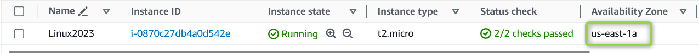

- Essayons maintenant de changer la **Availability Zone** de notre instance EC2 **sans** arguments `lifecycle` et observons le comportement
  
  ```hcl
  resource "aws_instance" "myec2" {
      ami = "ami-0df435f331839b2d6"
      instance_type = "t2.micro"
      # availability_zone = "us-east-1a"
      availability_zone = "us-east-1b"
  
      tags = {
      Name = "Linux2023"
      }
  
      # lifecycle {
      #   create_before_destroy = true
      # }
  }
  ```

- Exécutons les commandes Terraform pour comprendre le comportement des resources
  
  1. ***`terraform init`*** : *Initialiser* terraform
  
  2. ***`terraform validate`*** : *Valider* le code terraform
  
  3. ***`terraform fmt`*** : *Formater* le code terraform
  
  4. ***`terraform plan`*** : *Réviser* le plan terraform
  
  5. ***`terraform apply`*** : *Créer* des Resources avec terraform
  - Une fois que nous exécutons *`terraform apply`*, Terraform détruit d'abord les resources existantes puis crée la resource
    
    - Exemple de *`terraform apply`*
      
        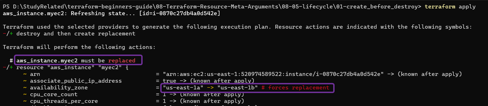
      
        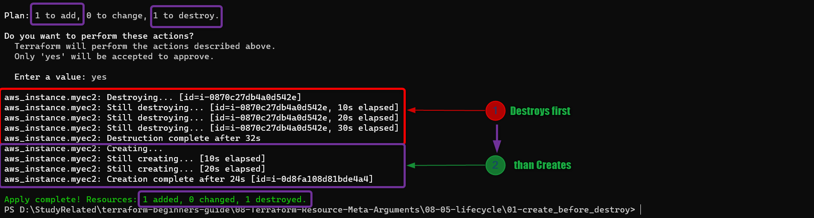
      
        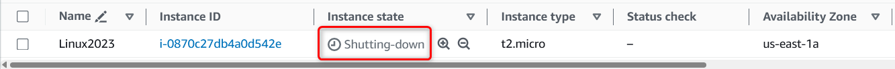
      
        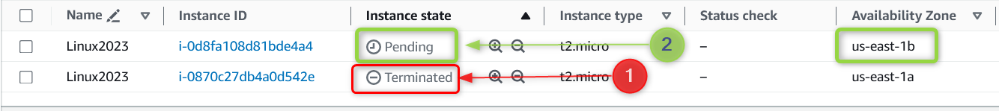

- Essayons maintenant de changer la Availability Zone de notre instance EC2 **avec** arguments `lifecycle` et observons le comportement
  
  ```hcl
  resource "aws_instance" "myec2" {
      ami = "ami-0df435f331839b2d6"
      instance_type = "t2.micro"
      availability_zone = "us-east-1a"
      # availability_zone = "us-east-1b"
  
      tags = {
      Name = "Linux2023"
      }
  
      lifecycle {
        create_before_destroy = true
      }
  }
  ```
  
  * Une fois que nous exécutons *`terraform apply`*, Terraform **crée d'abord la nouvelle resource, puis détruit l'ancienne resource existante**
    
    - Exemple de *`terraform apply`*
      
        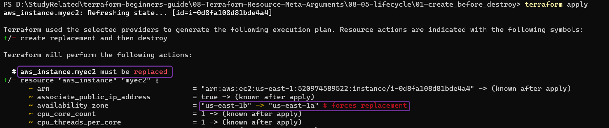
      
        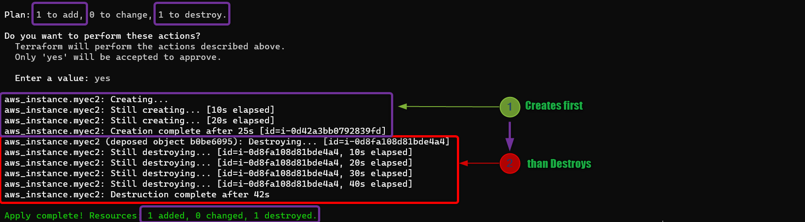
      
        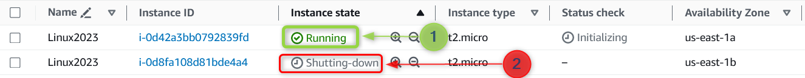

- **Exemple** : ***`prevent_destroy`***
  
  - Utilisons l'argument *`prevent_destroy`* et observons le comportement
    [01_ec2.tf](./02-prevent_destroy/02_ec2.tf)
    
    ```hcl
    resource "aws_instance" "myec2" {
    ami               = "ami-0df435f331839b2d6"
    instance_type     = "t2.micro"
    availability_zone = "us-east-1a"
    # availability_zone = "us-east-1b"
    
    tags = {
        Name = "Linux2023"
    }
    
    lifecycle {
        prevent_destroy = true
    }
    }
    ```
  
  - Exécutez la commande *`terraform destroy`* et observez le comportement
    
    - Terraform affiche **Error: Instance cannot be destroyed**
      
      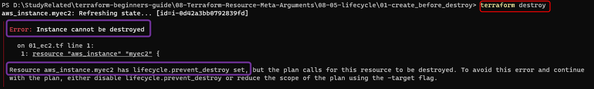

- **Exemple** : ***`ignore_changes`***
  
  - Utilisons le concept de tags et comprenons comment fonctionne `ignore_changes`
  
  - Nous allons d'abord **ajouter manuellement un *`tag`* sur notre EC2 AWS depuis la Console AWS** (ce tag ne faisait pas partie du code terraform)
    
      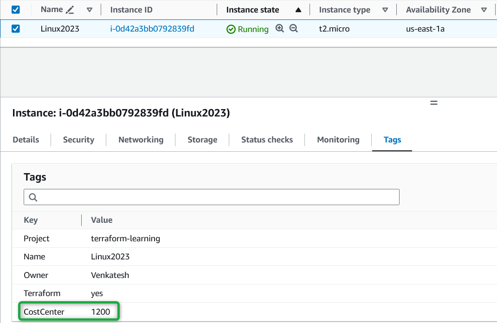

    - Exécutez *terraform plan* et observez comment terraform détecte les changements effectués sur la Console AWS
    - Terraform détecte les changements manuels effectués sur la Console AWS et si nous exécutons *terraform apply*, Terraform supprimera les tags appliqués manuellement sur l'EC2 AWS
        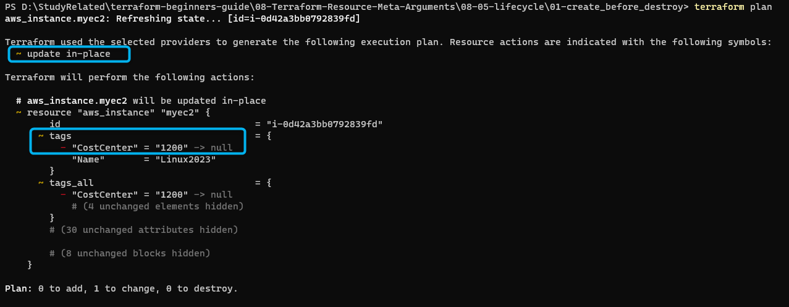
    
    - Ajoutons maintenant le meta-argument `ignore_changes` pour *tags* et observons le comportement de Terraform.
    
        [01_ec2.tf](./03-ignore_changes/01_ec2.tf)
    
        ```hcl
        resource "aws_instance" "myec2" {
        ami               = "ami-0df435f331839b2d6"
        instance_type     = "t2.micro"
        availability_zone = "us-east-1a"
        # availability_zone = "us-east-1b"
    
        tags = {
            Name = "Linux2023"
        }
    
        lifecycle {
            ignore_changes = [ tags ]
        }
        }
        ```
    - Exécutez *terraform plan* et observez comment terraform **ignore les changements** apportés aux tags depuis la Console AWS
         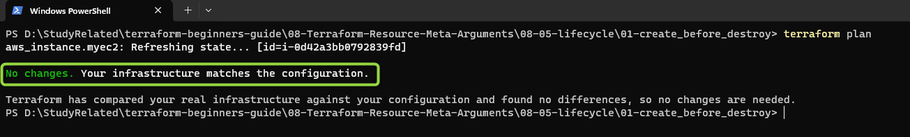

- ***`ignore_changes`*** peut également être utilisé pour **ignorer tous les changements d'une resource particulière** avec l'option *ignore_changes = all*
  
  - Terraform ignorera complètement tout changement sur tous les attributs de cette resource lors de tentatives de mise à jour ou de modification
  
  - Exemple :
    
    ```hcl
    resource "aws_instance" "myec2" {
    ami               = "ami-0df435f331839b2d6"
    instance_type     = "t2.micro"
    availability_zone = "us-east-1a"
    # availability_zone = "us-east-1b"
    
    tags = {
        Name = "Linux2023"
    }
    
    lifecycle {
        ignore_changes = [ all ]
    }
    }
    ```
  
  - Il est généralement préférable de spécifier les attributs exacts pour lesquels vous souhaitez ignorer les changements, plutôt que d'utiliser "*all*", afin d'avoir un contrôle plus précis sur les attributs à exclure des mises à jour

    #### Nettoyage
    
    6. ***`terraform destroy`*** : *Détruire ou supprimer* des Resources, Nettoyer les resources créées
        - Après avoir tapé ***yes*** à l'invite de *`terraform destroy`*, terraform commencera à **détruire** les resources
    
        - Une fois l'exécution de terraform terminée, vous devriez pouvoir vérifier sur votre Console AWS que les resources ont été supprimées avec succès.

### Références :

[Le Meta-Argument lifecycle](https://developer.hashicorp.com/terraform/language/meta-arguments/lifecycle)
