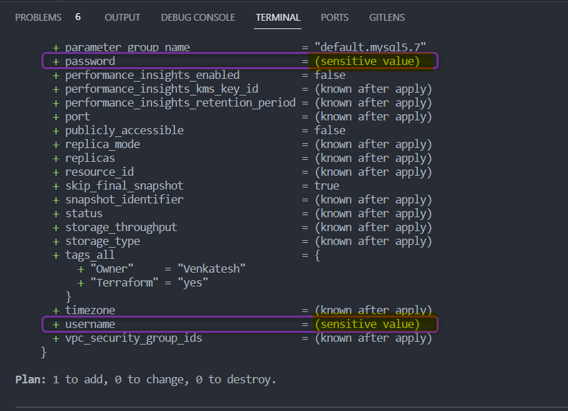
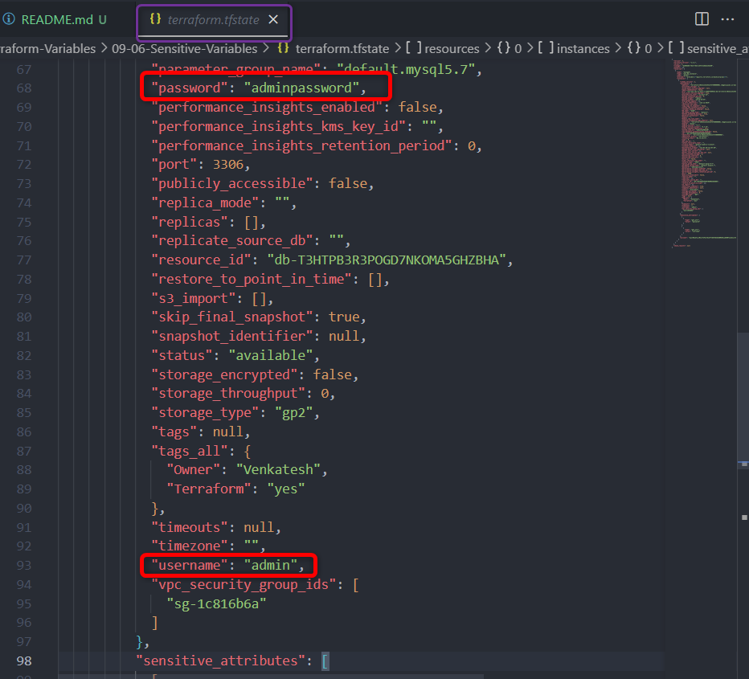

# Variables Terraform

## Variables d'Entrée Sensibles

- Pour gérer les variables d'entrée sensibles dans Terraform, vous pouvez utiliser l'argument ***`sensitive`*** dans le bloc de variable
- En définissant ***`sensitive = true`***, vous indiquez que la valeur de cette variable est sensible, et Terraform la traitera en conséquence.
- **Terraform n'affichera pas les valeurs réelles des variables sensibles** dans la console ou les logs lors des opérations *plan* ou *apply*. Il affichera à la place un espace réservé ***`(sensitive value)`***
- Si une variable sensible est utilisée dans une valeur `output`, **la sortie sera également traitée comme sensible**, et sa valeur ne sera pas affichée.
- **Remarque Importante :** Bien que Terraform aide à la visibilité et à la protection des données sensibles, vous devez toujours suivre les meilleures pratiques pour la gestion des secrets, comme l'utilisation d'un système de gestion des secrets (AWS Secret Manager), la restriction de l'accès aux informations sensibles et ne pas coder les secrets en dur dans vos fichiers de configuration.


- **Exemple** :

    [00_provider.tf](./00_provider.tf)
    ```hcl
    terraform {
    required_providers {
        aws = {
        source  = "hashicorp/aws"
        version = "~> 5.0"
        }
    }
    }

    provider "aws" {
    region = var.aws_region

    default_tags {
        tags = {
        Terraform = "yes"
        Owner = var.owner
        }
    }
    }
    ```

    [01_rds.tf](./01_rds.tf)
    ```hcl
    resource "aws_db_instance" "myrds" {
    allocated_storage    = 5
    db_name              = "mydb"
    engine               = "mysql"
    engine_version       = "5.7"
    instance_class       = "db.t2.micro"
    username             = var.db_username
    password             = var.db_password
    parameter_group_name = "default.mysql5.7"
    skip_final_snapshot  = true
    }
    ```

    [02_variables.tf](./02_variables.tf)
    ```hcl
    variable "aws_region" {
    description = "Région AWS dans laquelle les resources seront créées"
    type        = string
    default     = "us-east-1"
    }

    variable "owner" {
    description = "Nom de l'ingénieur qui crée les resources"
    type        = string
    default     = "Venkatesh"
    }

    variable "db_username" {
    description = "Nom d'utilisateur de la base de données"
    type        = string
    sensitive = true
    }

    variable "db_password" {
    description = "Mot de passe de la base de données"
    type        = string
    sensitive = true
    }
    ```
    [03_secrets.tfvars](./03_secrets.tfvars)
    ```hcl
    # Ceci est uniquement à des fins d'apprentissage - ne stockez pas d'informations sensibles dans un fichier en clair ni ne publiez le code sur GitHub.
    # Utilisez AWS Secret Manager pour stocker et récupérer vos secrets

    db_username = "admin"
    db_password = "adminpassword"
    ```

- Dans l'exemple ci-dessus,
    les variables `db_username` et `db_password` sont marquées *`sensitive = true`*


- Sortie de ***`terraform apply`***

    - Vous pouvez constater que `db_username` et `db_password` sont marqués avec la valeur ***`(sensitive value)`***

    

- ***`terraform state file`***
    - Veuillez noter que **le state file terraform *`terraform.tfstate`* stockera les informations sensibles en texte clair**, soyez donc prudent quant à la façon dont vous souhaitez l'utiliser.

    


    <details>
    <summary> <i>terraform apply</i> </summary>

    ```hcl
    $ terraform apply -var-file 03_secrets.tfvars

    Terraform used the selected providers to generate the following execution plan. Resource actions are indicated with the following symbols:
    + create

    Terraform will perform the following actions:

    # aws_db_instance.myrds will be created
    + resource "aws_db_instance" "myrds" {
        + address                               = (known after apply)
        + allocated_storage                     = 5
        + apply_immediately                     = false
        + arn                                   = (known after apply)
        + auto_minor_version_upgrade            = true
        + availability_zone                     = (known after apply)
        + backup_retention_period               = (known after apply)
        + backup_target                         = (known after apply)
        + backup_window                         = (known after apply)
        + ca_cert_identifier                    = (known after apply)
        + character_set_name                    = (known after apply)
        + copy_tags_to_snapshot                 = false
        + db_name                               = "mydb"
        + db_subnet_group_name                  = (known after apply)
        + delete_automated_backups              = true
        + endpoint                              = (known after apply)
        + engine                                = "mysql"
        + engine_version                        = "5.7"
        + engine_version_actual                 = (known after apply)
        + hosted_zone_id                        = (known after apply)
        + id                                    = (known after apply)
        + identifier                            = (known after apply)
        + identifier_prefix                     = (known after apply)
        + instance_class                        = "db.t2.micro"
        + iops                                  = (known after apply)
        + kms_key_id                            = (known after apply)
        + latest_restorable_time                = (known after apply)
        + license_model                         = (known after apply)
        + listener_endpoint                     = (known after apply)
        + maintenance_window                    = (known after apply)
        + master_user_secret                    = (known after apply)
        + master_user_secret_kms_key_id         = (known after apply)
        + monitoring_interval                   = 0
        + monitoring_role_arn                   = (known after apply)
        + multi_az                              = (known after apply)
        + nchar_character_set_name              = (known after apply)
        + network_type                          = (known after apply)
        + option_group_name                     = (known after apply)
        + parameter_group_name                  = "default.mysql5.7"
        + password                              = (sensitive value)
        + performance_insights_enabled          = false
        + performance_insights_kms_key_id       = (known after apply)
        + performance_insights_retention_period = (known after apply)
        + port                                  = (known after apply)
        + publicly_accessible                   = false
        + replica_mode                          = (known after apply)
        + replicas                              = (known after apply)
        + resource_id                           = (known after apply)
        + skip_final_snapshot                   = true
        + snapshot_identifier                   = (known after apply)
        + status                                = (known after apply)
        + storage_throughput                    = (known after apply)
        + storage_type                          = (known after apply)
        + tags_all                              = {
            + "Owner"     = "Venkatesh"
            + "Terraform" = "yes"
            }
        + timezone                              = (known after apply)
        + username                              = (sensitive value)
        + vpc_security_group_ids                = (known after apply)
        }

    Plan: 1 to add, 0 to change, 0 to destroy.

    Do you want to perform these actions?
    Terraform will perform the actions described above.
    Only 'yes' will be accepted to approve.

    Enter a value: yes

    aws_db_instance.myrds: Creating...
    aws_db_instance.myrds: Still creating... [10s elapsed]
    ...
    aws_db_instance.myrds: Creation complete after 4m54s [id=db-T3HTPB3R3POAB7NKOMA5XYZBHA]

    Apply complete! Resources: 1 added, 0 changed, 0 destroyed.
    ```

    </details>


## Références :

[Variables d'Entrée Sensibles Terraform](https://www.hashicorp.com/blog/terraform-sensitive-input-variables)

[Protéger les variables d'entrée sensibles](https://developer.hashicorp.com/terraform/tutorials/configuration-language/sensitive-variables)


