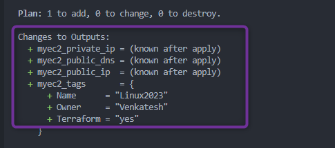
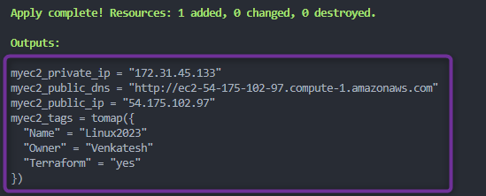
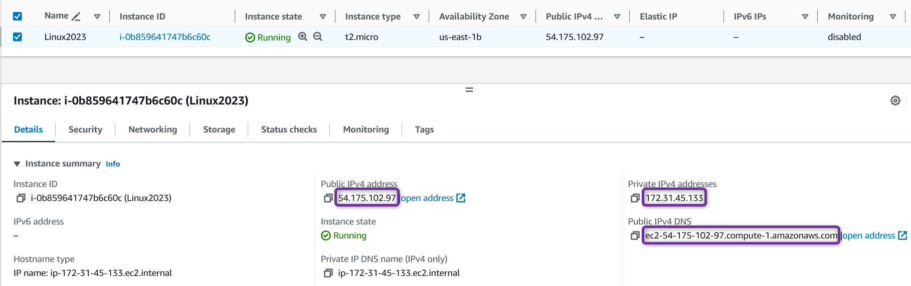
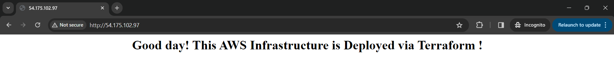

## Outputs Terraform

- Dans Terraform, les outputs vous permettent d'**exposer des informations sur votre infrastructure déployée**.
- Les outputs sont utiles pour **obtenir des informations sur votre infrastructure dont vous pourriez avoir besoin ultérieurement**.
- Les valeurs de sortie **peuvent être utilisées comme entrée pour d'autres configurations ou scripts Terraform**.
- Les outputs sont également utiles pour **partager des informations avec votre équipe ou des processus externes**.
- Vous **pouvez définir plusieurs outputs** dans une seule configuration Terraform pour obtenir différentes informations.
- Les outputs sont pratiques lorsque vous avez besoin de **connaître les détails de votre infrastructure, comme les adresses IP, les IDs d'instances ou les noms DNS**.
- Vous pouvez utiliser un bloc ***`output`*** pour spécifier quelles informations vous souhaitez extraire.


**Syntaxe** :

```hcl
output "nom_local" {
value = type_resource.nom_resource.attribute_ou_argument
}
```

**Exemple** :

[00_provider.tf](./00_provider.tf)

```hcl
terraform {
  required_providers {
    aws = {
      source  = "hashicorp/aws"
      version = "~> 5.0"
    }
  }
}

provider "aws" {
  region = var.aws_region

  default_tags {
    tags = {
      Terraform = "yes"
      Owner     = var.owner
    }
  }
}
```

[01_ec2.tf](./01_ec2.tf)

```hcl
resource "aws_instance" "myec2" {
  ami           = var.ec2_ami
  instance_type = var.ec2_instance_type
  user_data     = <<EOF
  #!/bin/bash
  sudo yum update -y
  sudo yum install httpd -y
  sudo systemctl enable httpd
  sudo systemctl start httpd
  echo "<html><body><div><h1><center> Bonjour ! Cette Infrastructure AWS est déployée via Terraform ! </center></h1></div></body></html>" | sudo tee /var/www/html/index
  EOF

  tags = {
    Name = "Linux2023"
  }
}
```

[02_variables.tf](./02_variables.tf)

```hcl
variable "aws_region" {
  description = "Région AWS dans laquelle les resources seront créées"
  type        = string
  default     = "us-east-1"
}

variable "owner" {
  description = "Nom de l'ingénieur qui crée les resources"
  type        = string
  default     = "Venkatesh"
}

variable "ec2_ami" {
  description = "AMI EC2 AWS Amazon Linux 2023"
  type        = string
  default     = "ami-0df435f331839b2d6" # Amazon Linux 2023
}

variable "ec2_instance_type" {
  description = "Type d'instance EC2"
  type        = string
  default     = "t2.micro"
}
```

[03_outputs.tf](./03_outputs.tf)

```hcl
output "myec2_public_ip" {
  description = "IP Publique de l'Instance EC2"
  value       = aws_instance.myec2.public_ip
}

output "myec2_private_ip" {
  description = "IP Privée de l'Instance EC2"
  value       = aws_instance.myec2.private_ip
}

output "myec2_tags" {
  description = "Tags de l'Instance EC2"
  value       = aws_instance.myec2.tags
}

output "myec2_public_dns" {
  description = "DNS Public"
  value       = "http://${aws_instance.myec2.public_dns}"
}
```

- Dans l'exemple ci-dessus, nous avons défini quatre Outputs qui seront affichés lors du *`terraform plan`* ou du *`terraform apply`* :
    1\. `myec2_public_ip` : IP Publique de l'Instance EC2
    2\. `myec2_private_ip` : IP Privée de l'Instance EC2
    3\. `myec2_tags` : Tags de l'Instance EC2
    4\. `myec2_public_dns` : DNS Public de l'Instance EC2

- Exécutons les commandes Terraform pour comprendre le comportement des resources
  
  1. ***`terraform init`*** : *Initialiser* terraform
  
  2. ***`terraform validate`*** : *Valider* le code terraform
  
  3. ***`terraform fmt`*** : *Formater* le code terraform
  
  4. ***`terraform plan`*** : *Réviser* le plan terraform
  
  5. ***`terraform apply`*** : *Créer* des Resources avec terraform
     
     - Exemple de *`terraform plan`*
     
     - La sortie du plan montre certaines valeurs d'outputs à connaître après l'apply
          
     
     - Exemple de *`terraform apply`*
     
     - La sortie de terraform apply affiche les valeurs d'outputs définies dans les blocs ***`output`***
     
     - Vous pouvez constater que `myec2_private_ip`, `myec2_public_dns`, `myec2_public_ip` et `myec2_tags` sont affichés après l'exécution de `terraform apply`
       
          
     
     <details>
     <summary> <i>terraform apply</i> </summary>
     
     ```hcl
     $ terraform apply
     
     Terraform used the selected providers to generate the following execution plan. Resource actions are indicated with the following symbols:
     + create
     
     Terraform will perform the following actions:
     
     # aws_instance.myec2 will be created
     + resource "aws_instance" "myec2" {
        + ami                                  = "ami-0df435f331839b2d6"
        ...
        + instance_type                        = "t2.micro"
        ...
        }
     
     Plan: 1 to add, 0 to change, 0 to destroy.
     
     Changes to Outputs:
     + myec2_private_ip = (known after apply)
     + myec2_public_dns = (known after apply)
     + myec2_public_ip  = (known after apply)
     + myec2_tags       = {
        + Name      = "Linux2023"
        + Owner     = "Venkatesh"
        + Terraform = "yes"
        }
     
     Do you want to perform these actions?
     Terraform will perform the actions described above.
     Only 'yes' will be accepted to approve.
     
     Enter a value: yes
     
     aws_instance.myec2: Creating...
     aws_instance.myec2: Still creating... [10s elapsed]
     aws_instance.myec2: Still creating... [20s elapsed]
     aws_instance.myec2: Still creating... [30s elapsed]
     aws_instance.myec2: Creation complete after 36s [id=i-0b859641747b6c60c]
     
     Apply complete! Resources: 1 added, 0 changed, 0 destroyed.
     
     Outputs:
     
     myec2_private_ip = "172.31.45.133"
     myec2_public_dns = "http://ec2-54-175-102-97.compute-1.amazonaws.com"
     myec2_public_ip = "54.175.102.97"
     myec2_tags = tomap({
     "Name" = "Linux2023"
     "Owner" = "Venkatesh"
     "Terraform" = "yes"
     })
     ```
     
     </details>

Console AWS

 

  

## Références :

[Valeurs de Sortie](https://developer.hashicorp.com/terraform/language/values/outputs)
