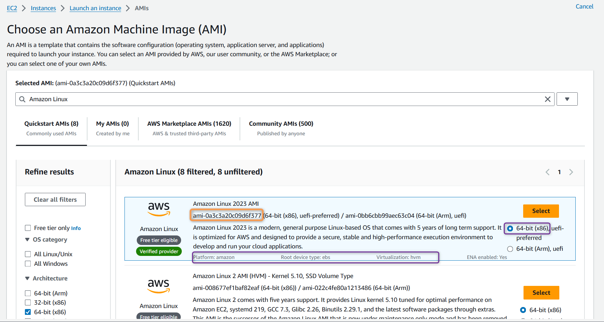
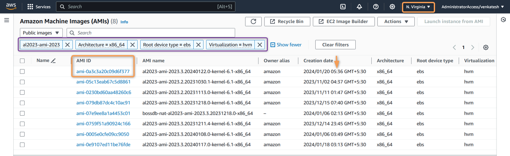
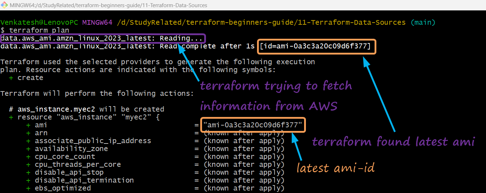
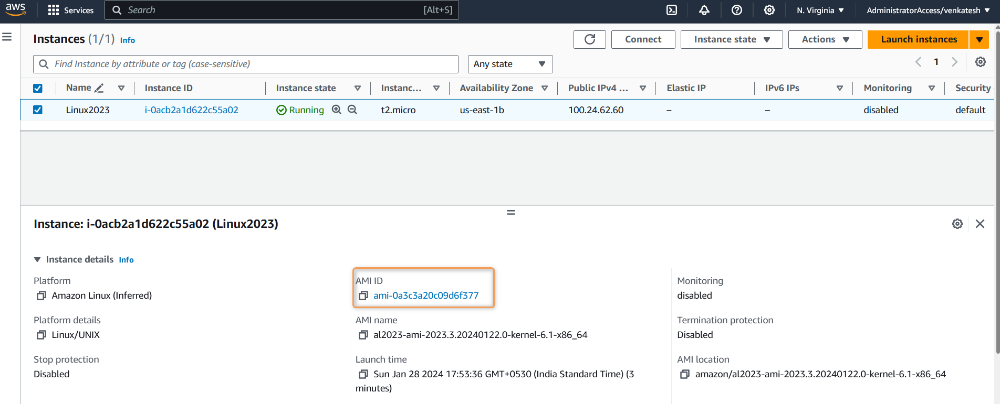

# Data Sources Terraform

## Data Sources

- Les data resources dans Terraform vous permettent de **récupérer des informations** ou d'**interroger des ressources existantes en dehors de la configuration**

- Les data resources **ne créent ni ne gèrent d'infrastructure**. Elles fournissent un **moyen de référencer des données externes**

- **Données Immuables :** Les data resources offrent un moyen d'interagir avec des données externes, mais elles **ne modifient pas ces données**. **Elles sont en lecture seule**.

- **Blocs Data :** La structure d'un bloc data est similaire à celle d'un resource block, mais avec le mot-clé **`data`**.

- **Valeurs Dynamiques :** Vous pouvez utiliser des valeurs dynamiques provenant des data resources à divers endroits dans votre configuration Terraform.

**Syntaxe** :

```hcl
data "type" "nom" {
    argument1 = "valeur1"
    argument2 = "valeur2"
    ......... = "......"

    filter {
    name = "<nom>"
    values = "<valeur>"
    }

    filter {
    name = "<nom>"
    values = "<valeur>"
    }
}
```

**Exemple** :

[00_provider.tf](./00_provider.tf)

```hcl
terraform {
  required_providers {
    aws = {
      source  = "hashicorp/aws"
      version = "~> 5.0"
    }
  }
}

provider "aws" {
  region = var.aws_region

  default_tags {
    tags = {
      Terraform = "yes"
      Owner     = var.owner
    }
  }
}
```

[01_ec2.tf](./01_ec2.tf)

```hcl
resource "aws_instance" "myec2" {
  ami = data.aws_ami.amzn_linux_2023_latest.id # récupération de l'ID AMI Amazon Linux le plus récent depuis les data sources
  instance_type = var.ec2_instance_type

  tags = {
    Name = "Linux2023"
  }
}
```

[02_variables.tf](./02_variables.tf)

```hcl
variable "aws_region" {
  description = "Région AWS dans laquelle les resources seront créées"
  type        = string
  default     = "us-east-1"
}

variable "owner" {
  description = "Nom de l'ingénieur qui crée les resources"
  type        = string
  default     = "Venkatesh"
}

# Section AMI : nous allons utiliser des data resources pour récupérer le dernier AMI Amazon Linux
/*variable "ec2_ami" {
  description = "AMI EC2 AWS Amazon Linux 2023"
  type        = string
  default     = "ami-0df435f331839b2d6" # Amazon Linux 2023
}*/

variable "ec2_instance_type" {
  description = "Type d'instance EC2"
  type        = string
  default     = "t2.micro"
}
```

[03_data.tf](./03_data.tf)

```hcl
data "aws_ami" "amzn_linux_2023_latest" {
    most_recent = true
    owners = [ "amazon" ]

    filter {
      name = "name"
      values = [ "al2023-ami-2023*" ]
    }

    filter {
      name = "architecture"
      values = [ "x86_64" ]
    }

    filter {
      name = "root-device-type"
      values = [ "ebs" ]
    }

    filter {
      name = "virtualization-type"
      values = [ "hvm" ]
    }
}
```

- Dans l'exemple ci-dessus, nous essayons de récupérer le dernier AMI Amazon Linux 2023 EC2 AWS (situé dans us-east-1) en fonction des filtres suivants
  
    1\. `most_recent` = `true`, pour récupérer l'AMI le plus *récent*
    2\. `name` = `al2023-ami-2023*` pour récupérer l'AMI dont le nom commence par *al2023-ami-2023*
    3\. `architecture` = `x86_64` pour récupérer l'AMI de type *x86_64*
    4\. `root-device-type` = `ebs` pour récupérer l'AMI de type de périphérique racine *ebs*
    5\. `virtualization-type` = `hvm` pour récupérer l'AMI de type de virtualisation *hvm*

- En filtrant avec un schéma similaire sur la Console AWS, vous devriez voir,
  
    Console de lancement AWS :
  
        
  
    Console AMI publique AWS (Page EC2 ==> AMI) :
  
        
  
  - Pour des types de filtres supplémentaires, veuillez consulter [AWS CLI describe-images](http://docs.aws.amazon.com/cli/latest/reference/ec2/describe-images.html)

- Exécutons les commandes Terraform pour comprendre le comportement des data sources
  
  1. ***`terraform init`*** : *Initialiser* terraform
  
  2. ***`terraform validate`*** : *Valider* le code terraform
  
  3. ***`terraform fmt`*** : *Formater* le code terraform
  
  4. ***`terraform plan`*** : *Réviser* le plan terraform
  
  5. ***`terraform apply`*** : *Créer* des Resources avec terraform
     
     - Exemple de *`terraform plan`* ou *`terraform apply`*
     - La sortie du plan affiche le dernier ID d'AMI Amazon Linux 2023 EC2 AWS
          
     
     <details>
     <summary> <i>terraform apply</i> </summary>
     
     ```hcl
     $ terraform apply
     data.aws_ami.amzn_linux_2023_latest: Reading...
     data.aws_ami.amzn_linux_2023_latest: Read complete after 1s [id=ami-0a3c3a20c09d6f377]
     
     Terraform used the selected providers to generate the following execution
     plan. Resource actions are indicated with the following symbols:
  + create
    
    Terraform will perform the following actions:
    
    # aws_instance.myec2 will be created
  
  + resource "aws_instance" "myec2" {
    
    + ami                                  = "ami-0a3c3a20c09d6f377"
      ...
    + instance_type                        = "t2.micro"
      ...
      }
    
    Plan: 1 to add, 0 to change, 0 to destroy.
    
    Do you want to perform these actions?
    Terraform will perform the actions described above.
    Only 'yes' will be accepted to approve.
    
    Enter a value: yes
    
    aws_instance.myec2: Creating...
    aws_instance.myec2: Still creating... [10s elapsed]
    aws_instance.myec2: Still creating... [20s elapsed]
    aws_instance.myec2: Creation complete after 25s [id=i-0acb2a1d622c55a02]
    
    Apply complete! Resources: 1 added, 0 changed, 0 destroyed.
    
    ```
    </details>
    ```
  - Vous pouvez maintenant trouver sur la Console AWS l'instance EC2 créée avec le dernier AMI Amazon Linux 2023
    
    

## Références :

[Data Sources](https://developer.hashicorp.com/terraform/language/data-sources)

[Data Source : aws_ami](https://registry.terraform.io/providers/hashicorp/aws/latest/docs/data-sources/ami)

[AWS CLI describe-images](http://docs.aws.amazon.com/cli/latest/reference/ec2/describe-images.html)
