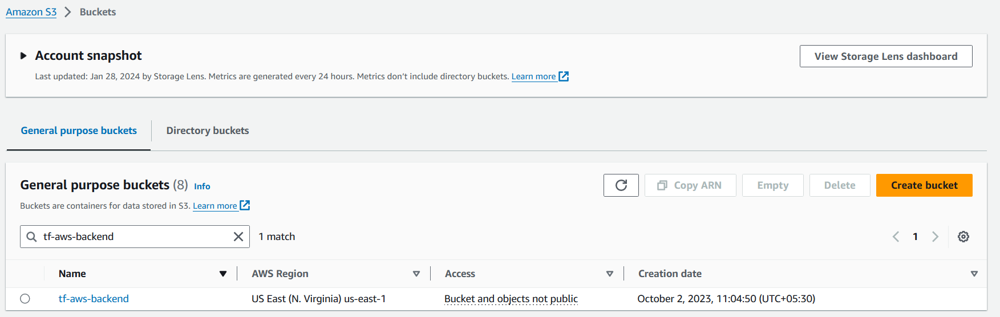
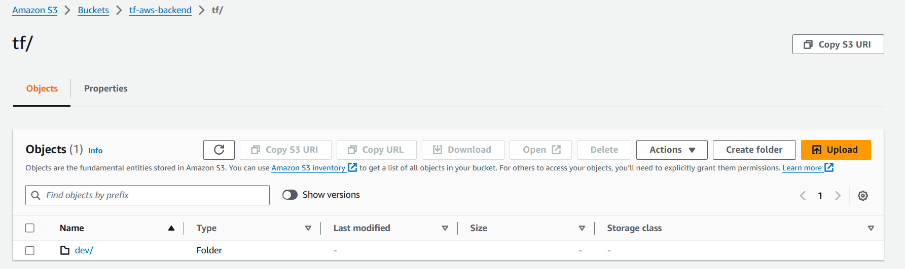
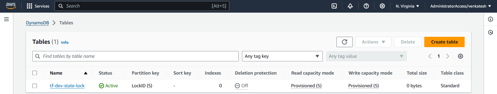
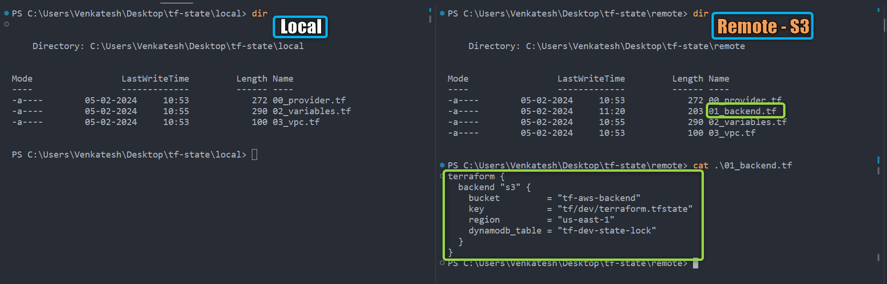
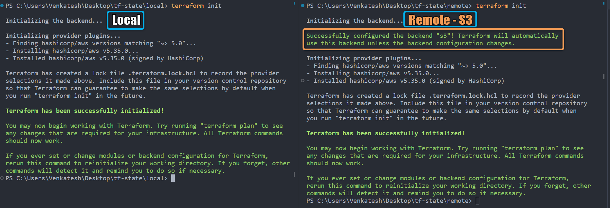
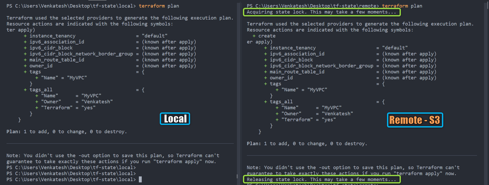
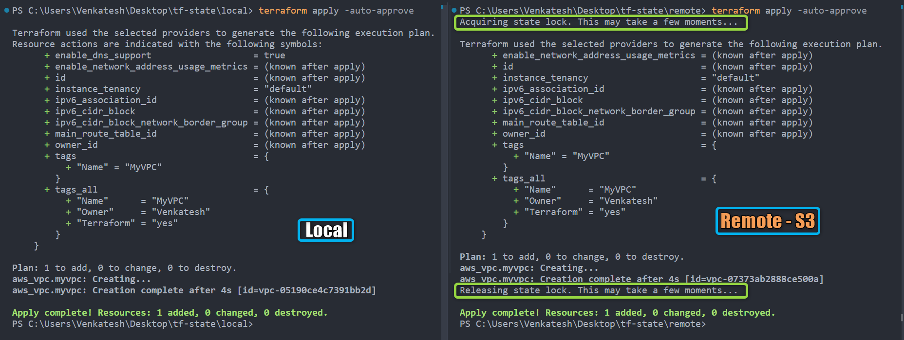
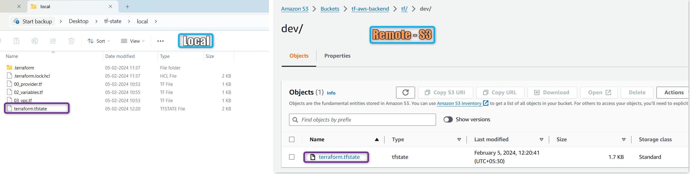
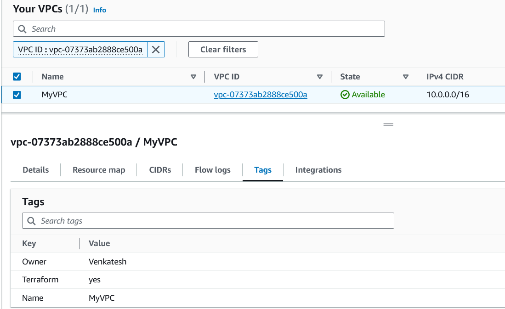
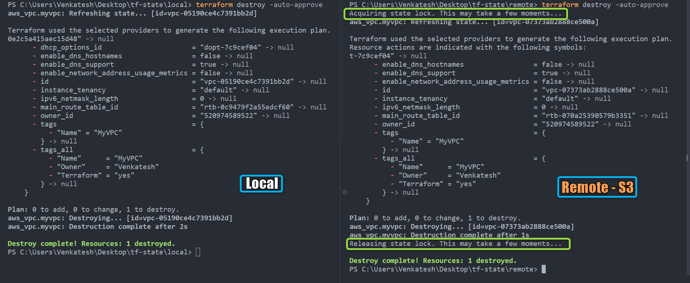

# State Terraform

## Fichier State Terraform

- Le fichier state Terraform (*`terraform.tfstate`*) est un composant critique dans la gestion de l'infrastructure.
- Le state est utilisé par Terraform
  - **pour mapper les ressources réelles à votre configuration**
  - **suivre les métadonnées**
  - **améliorer les performances** pour les grandes infrastructures
- Terraform utilise le state **pour déterminer quels changements apporter à votre infrastructure**.
- Avant toute opération, Terraform effectue un ***refresh*** pour mettre à jour le state avec l'infrastructure réelle.


### Objectif du Fichier State :

1. **Suivi des Resources** : Stocke l'état courant des resources définies avec des détails comme les IDs de resource et les adresses IP.

2. **Gestion des Dépendances** : Gère les dépendances entre les resources, assurant un ordre d'application correct pour les changements.

3. **Concurrence et Verrouillage** : Gère l'accès concurrent en utilisant des verrous de state pour prévenir les conflits.

### Emplacement du Fichier State :

- Par défaut, le fichier state est **stocké localement dans le même répertoire**.
- Pour les grandes infrastructures d'entreprise, il est recommandé d'utiliser des ***backends distants*** (**AWS S3, Azure Storage, Terraform Cloud**, etc.) pour faciliter la collaboration et éviter les problèmes liés au fichier state local.
- L'utilisation d'un **backend distant améliore la sécurité, la collaboration et le contrôle de version** dans les workflows Terraform.


## State Local vs. State Distant

| **Type**        | **State Local**                                         | **State Distant (AWS S3)**                                        |
| --------------- | ------------------------------------------------------- | ----------------------------------------------------------------- |
| **Emplacement** | Stocké **localement** dans le répertoire du projet.     | Stocké dans un **backend distant**, ex : AWS S3.                  |
| **Concurrence** | Non adapté à la collaboration. Absence de verrouillage. | **Permet la collaboration** avec verrouillage du backend.         |
| **Sécurité**    | Les informations sensibles peuvent être exposées.       | Contrôle d'accès **granulaire** avec les politiques AWS IAM.      |
| **Sauvegardes** | Sujettes à **suppression accidentelle** ou perte.       | **Versionnée**, durabilité et disponibilité automatiques avec S3. |

### Avantages du State Distant (AWS S3) :

- **Collaboration** : Prend en charge la collaboration en équipe en fournissant un emplacement centralisé pour les fichiers state.
- **Mécanismes de Verrouillage** : Prévient les conflits lors des opérations simultanées.
- **Sécurité** : Utilise les rôles et politiques AWS IAM pour le contrôle d'accès.
- **Versionnement** : Profitez du versionnement S3
- **Durabilité et Disponibilité** : AWS S3 garantit la durabilité et la disponibilité automatiques des fichiers state.

### Implémentation d'AWS S3 comme Backend de State Distant et DynamoDB pour le Verrouillage du State :

1. [Créer un bucket S3](https://docs.aws.amazon.com/AmazonS3/latest/userguide/creating-bucket.html) sur votre compte AWS.
   
   - Ex : **tf-aws-backend** (Les noms de buckets sont uniques, choisissez un nom unique de votre choix)
     

2. Créer le dossier **tf/dev** (vous pouvez choisir n'importe quel nom) — ici **tf/dev** signifie simplement terraform et environnement dev
   
   - 

3. [Créer une table DynamoDB](https://docs.aws.amazon.com/amazondynamodb/latest/developerguide/getting-started-step-1.html) pour faciliter le verrouillage du fichier state
   
   - Nom de la table : **tf-dev-state-lock**
   
   - Clé de partition (Clé Primaire) : **LockID** (Type : String)
   
   - Paramètres de la table : Utiliser les paramètres par défaut (coché)
   
   - 

4. utiliser le bloc *`backend`* de terraform pour configurer le state distant

**Syntaxe** :

```hcl
terraform {
  backend "s3" {
    bucket         = "tf-aws-backend"
    key            = "tf/dev/terraform.tfstate"
    region         = "us-east-1"
    encrypt        = true
    dynamodb_table = "tf-dev-state-lock"
  }
}
```

**Exemple** :

- Créons un VPC simple et observons le comportement du state Terraform avec S3 et DynamoDB

[00_provider.tf](./00_provider.tf)

```hcl
terraform {
  required_providers {
    aws = {
      source  = "hashicorp/aws"
      version = "~> 5.0"
    }
  }
}

provider "aws" {
  region = var.aws_region

  default_tags {
    tags = {
      Terraform = "yes"
      Owner     = var.owner
    }
  }
}
```

[01_backend.tf](./01_backend.tf)

```hcl
terraform {
  backend "s3" {
    bucket         = "tf-aws-backend"
    key            = "tf/dev/terraform.tfstate"
    region         = "us-east-1"
    dynamodb_table = "tf-dev-state-lock"
  }
}
```

[02_variables.tf](./02_variables.tf)

```hcl
variable "aws_region" {
  description = "Région AWS dans laquelle les resources seront créées"
  type        = string
  default     = "us-east-1"
}

variable "owner" {
  description = "Nom de l'ingénieur qui crée les resources"
  type        = string
  default     = "Venkatesh"
}
```

[03_vpc.tf](./03_vpc.tf)

```hcl
resource "aws_vpc" "myvpc" {
  cidr_block = "10.0.0.0/16"

  tags = {
    Name = "MyVPC"
  }
}
```

- Dans l'exemple ci-dessus, nous essayons de créer un VPC simple et d'observer le comportement du state Terraform avec S3 et DynamoDB
  
    1\. `cidr_block` = `10.0.0.0/16`, c'est le CIDR du VPC

- Exécutons les commandes Terraform pour comprendre le comportement des data sources
  
  1. ***`terraform init`*** : *Initialiser* terraform
  2. ***`terraform validate`*** : *Valider* le code terraform
  3. ***`terraform fmt`*** : *Formater* le code terraform
  4. ***`terraform plan`*** : *Réviser* le plan terraform
  5. ***`terraform apply`*** : *Créer* des Resources avec terraform

- Pour comparaison, j'exécute également du code similaire ([local](./tf-state-demo-files/local/)) sans S3 comme backend et observe comment Terraform se comporte dans chaque cas.
  
  - **`fichiers terraform`** :
    
    
    
    | Type                | Local                 | Distant                                            |
    | ------------------- | --------------------- | -------------------------------------------------- |
    | **Fichier Backend** | Aucun fichier backend | Fichier backend [*01_backend.tf*](./01_backend.tf) |
  
  - ***`terraform init`*** :
    
    
    
    | Type                       | Local                          | Distant                              |
    | -------------------------- | ------------------------------ | ------------------------------------ |
    | **Backend**                | Non mentionné explicitement    | Configuré avec "s3"                  |
    | **Initialisation Backend** | Message d'initialisation local | Backend "s3" configuré avec succès ! |
  
  - ***`terraform plan`*** :
    
    
    
    | Type                   | Local              | Distant                                                  |
    | ---------------------- | ------------------ | -------------------------------------------------------- |
    | **Verrouillage State** | Aucun Verrouillage | ***Acquisition*** et ***Libération*** du verrou de state |
  
  - ***`terraform Apply`*** :
    
    
    
    | Type                   | Local              | Distant                                                  |
    | ---------------------- | ------------------ | -------------------------------------------------------- |
    | **Verrouillage State** | Aucun Verrouillage | ***Acquisition*** et ***Libération*** du verrou de state |
  
  - **`Fichier State Terraform`** :
    
    
    
    | Type                             | Local               | Distant                               |
    | -------------------------------- | ------------------- | ------------------------------------- |
    | **Emplacement du Fichier State** | Stocké *localement* | Stocké *à distance* dans le Bucket S3 |
  
  <details>
  <summary> <i>terraform apply</i> </summary>
  
  ```hcl
      PS C:\Users\Venkatesh\Desktop\tf-state\remote> terraform apply -auto-approve
  Acquiring state lock. This may take a few moments...
  
  Terraform used the selected providers to generate the following execution plan.
        + enable_network_address_usage_metrics = (known after apply)
        + id                                   = (known after apply)
        + instance_tenancy                     = "default"
        + ipv6_association_id                  = (known after apply)
        + ipv6_cidr_block                      = (known after apply)
        + ipv6_cidr_block_network_border_group = (known after apply)
        + main_route_table_id                  = (known after apply)
        + owner_id                             = (known after apply)
        + tags                                 = {
            + "Name" = "MyVPC"
          }
        + tags_all                             = {
            + "Name"      = "MyVPC"
            + "Owner"     = "Venkatesh"
            + "Terraform" = "yes"
          }
      }
  
  Plan: 1 to add, 0 to change, 0 to destroy.
  aws_vpc.myvpc: Creating...
  aws_vpc.myvpc: Creation complete after 4s [id=vpc-07373ab2888ce500a]
  Releasing state lock. This may take a few moments...
  ```
  
  </details>
  
  - Vous pouvez maintenant trouver sur la Console AWS le VPC avec le CIDR 10.0.0.0/16 créé.
    
    
  
  - ***`terraform Destroy`*** : ** uniquement pour les tests et le nettoyage ** , Ne pas utiliser ou utiliser avec précaution pour votre infrastructure réelle
    
    
    
    | Type                   | Local              | Distant                                                  |
    | ---------------------- | ------------------ | -------------------------------------------------------- |
    | **Verrouillage State** | Aucun Verrouillage | ***Acquisition*** et ***Libération*** du verrou de state |

    <details>
    <summary> <i>terraform destroy</i> </summary>
    
    ```hcl
    PS C:\Users\Venkatesh\Desktop\tf-state\remote> terraform destroy -auto-approve
    Acquiring state lock. This may take a few moments...
    aws_vpc.myvpc: Refreshing state... [id=vpc-07373ab2888ce500a]
    
    Terraform used the selected providers to generate the following execution plan.
    Resource actions are indicated with the following symbols:
    ...
    Plan: 0 to add, 0 to change, 1 to destroy.
    aws_vpc.myvpc: Destroying... [id=vpc-07373ab2888ce500a]
    aws_vpc.myvpc: Destruction complete after 1s
    Releasing state lock. This may take a few moments...
    
    Destroy complete! Resources: 1 destroyed.
    PS C:\Users\Venkatesh\Desktop\tf-state\remote>
    ```
    </details>

## Références :

State Terraform : https://developer.hashicorp.com/terraform/language/state

<!-- Terraform State : [https://developer.hashicorp.com/terraform/language/state](https://developer.hashicorp.com/terraform/language/state) -->
