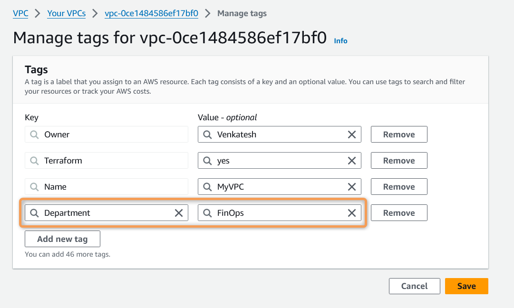
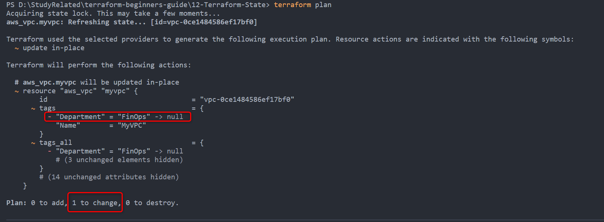

# Terraform Refresh

## Commande Terraform *`refresh`*

- La commande *`terraform refresh`* est utilisée pour **mettre à jour le fichier state de votre projet Terraform (état désiré) avec l'infrastructure réelle (état courant)**.
- Lorsque vous exécutez la commande *`terraform refresh`*, Terraform **interroge l'état réel** de votre infrastructure et **le compare avec le fichier state** qu'il maintient localement ou à distance.
- La commande *`terraform refresh`* **synchronise le state Terraform avec l'état réel de votre infrastructure**.

### Que se passe-t-il lors de l'exécution de la commande *`terraform refresh`* ?

1. **Interrogation de l'Infrastructure** : Terraform communique avec le provider (ex. : AWS, Azure) pour récupérer l'état courant de toutes les resources définies dans votre configuration.

2. **Comparaison avec le Fichier State** : Il compare l'état courant de l'infrastructure avec l'état stocké dans le fichier state.

3. **Mise à Jour du Fichier State** : Toute différence constatée entre l'infrastructure réelle et le fichier state est mise à jour dans le fichier state.

4. **Ne Modifie pas l'Infrastructure** : Contrairement à `terraform apply`, `terraform refresh` **met uniquement à jour le fichier state** et **n'apporte aucune modification** à l'infrastructure réelle.

### Quand utiliser la commande *`terraform refresh`*

- **Après des Modifications Externes** : Utilisez *`terraform refresh`* lorsque vous suspectez que des modifications ont été apportées à votre infrastructure en dehors de Terraform.

- **Avant d'Appliquer des Changements** : Il est souvent conseillé d'exécuter *`terraform refresh`* avant `terraform apply` pour s'assurer que votre configuration Terraform est basée sur les informations les plus récentes.

**Exemple** :

- Créons un VPC simple et découvrons la commande `terraform refresh`

[00_provider.tf](./00_provider.tf)

```hcl
terraform {
  required_providers {
    aws = {
      source  = "hashicorp/aws"
      version = "~> 5.0"
    }
  }
}

provider "aws" {
  region = var.aws_region

  default_tags {
    tags = {
      Terraform = "yes"
      Owner     = var.owner
    }
  }
}
```

[01_backend.tf](./01_backend.tf)

```hcl
terraform {
  backend "s3" {
    bucket         = "tf-aws-backend"
    key            = "tf/dev/terraform.tfstate"
    region         = "us-east-1"
    dynamodb_table = "tf-dev-state-lock"
  }
}
```

[02_variables.tf](./02_variables.tf)

```hcl
variable "aws_region" {
  description = "AWS Region In Which Resources will be Created"
  type        = string
  default     = "us-east-1"
}

variable "owner" {
  description = "Name of the Engineer who is creating Resources"
  type        = string
  default     = "Venkatesh"
}
```

[03_vpc.tf](./03_vpc.tf)

```hcl
resource "aws_vpc" "myvpc" {
  cidr_block = "10.0.0.0/16"

  tags = {
    Name = "MyVPC"
  }
}
```

- Dans l'exemple ci-dessus,
  
  - Nous essayons de créer un VPC simple via Terraform
  - Ajoutons manuellement le tag `Department = FinOps` au VPC depuis la Console AWS
  - Observons le comportement par rapport à `terraform refresh`

- Exécutons les commandes Terraform pour comprendre le comportement de `terraform refresh`
  
  1. ***`terraform init`*** : *Initialiser* Terraform
  2. ***`terraform validate`*** : *Valider* le code Terraform
  3. ***`terraform fmt`*** : *Formater* le code Terraform
  4. ***`terraform plan`*** : *Réviser* le plan Terraform
  5. ***`terraform apply`*** : *Créer* des Resources avec Terraform

<details>
  <summary> <i>terraform apply</i> </summary


```powershell
PS D:\StudyRelated\terraform-beginners-guide\14-Terraform-Refresh> terraform apply -auto-approve
```

</details>

- Vous pouvez maintenant trouver sur la Console AWS le VPC avec le CIDR 10.0.0.0/16 créé. Ajoutons maintenant manuellement le tag `Department = FinOps`, puis exécutons `terraform plan` pour voir comment Terraform détecte le changement et propose de supprimer les modifications manuelles.
  
    

- ***`terraform plan`*** : Détecte le changement et propose de supprimer les modifications manuelles
  
     
  
  <details>
  <summary> <i>terraform plan</i> </summary>
  
  ```hcl
  PS D:\StudyRelated\terraform-beginners-guide\14-Terraform-Refresh> terraform plan
  Acquiring state lock. This may take a few moments...
  aws_vpc.myvpc: Refreshing state... [id=vpc-0ce1484586ef17bf0]
  
  Terraform used the selected providers to generate the following execution plan. Resource actions are indicated with the following symbols:
  ~ update in-place
  
  Terraform will perform the following actions:
  
  # aws_vpc.myvpc will be updated in-place
  ~ resource "aws_vpc" "myvpc" {
          id                                   = "vpc-0ce1484586ef17bf0"
      ~ tags                                 = {
          - "Department" = "FinOps" -> null
              "Name"       = "MyVPC"
          }
      ~ tags_all                             = {
          - "Department" = "FinOps" -> null
              # (3 unchanged elements hidden)
          }
          # (14 unchanged attributes hidden)
      }
  
  Plan: 0 to add, 1 to change, 0 to destroy.
  ```
  
  </details>

- Exécutons maintenant la commande *`terraform refresh`* pour synchroniser l'infrastructure réelle (état courant) avec les fichiers tf Terraform (état désiré)
  
  ```hcl
      PS D:\StudyRelated\terraform-beginners-guide\14-Terraform-Refresh> terraform refresh
      Acquiring state lock. This may take a few moments...
      aws_vpc.myvpc: Refreshing state... [id=vpc-0ce1484586ef17bf0]
      Releasing state lock. This may take a few moments...
      PS D:\StudyRelated\terraform-beginners-guide\14-Terraform-Refresh>
  ```

- Exécutons maintenant la commande *`terraform show`* pour voir le nouveau tag `Department = FinOps` mis à jour dans le fichier state Terraform
  
  ```hcl
  PS D:\StudyRelated\terraform-beginners-guide\14-Terraform-Refresh> terraform show
  # aws_vpc.myvpc:
  resource "aws_vpc" "myvpc" {
      arn                                  = "arn:aws:ec2:us-east-1:520974589522:vpc/vpc-0ce1484586ef17bf0"
      assign_generated_ipv6_cidr_block     = false
      cidr_block                           = "10.0.0.0/16"
      default_network_acl_id               = "acl-008d6f0c48dbb7170"
      default_route_table_id               = "rtb-09b93a8f5486a6f76"
      default_security_group_id            = "sg-0418ad85d2ece013a"
      dhcp_options_id                      = "dopt-7c9cef04"
      enable_dns_hostnames                 = false
      enable_dns_support                   = true
      enable_network_address_usage_metrics = false
      id                                   = "vpc-0ce1484586ef17bf0"
      instance_tenancy                     = "default"
      ipv6_netmask_length                  = 0
      main_route_table_id                  = "rtb-09b93a8f5486a6f76"
      owner_id                             = "520974589522"
      tags                                 = {
          "Department" = "FinOps"
          "Name"       = "MyVPC"
      }
      tags_all                             = {
          "Department" = "FinOps"
          "Name"       = "MyVPC"
          "Owner"      = "Venkatesh"
          "Terraform"  = "yes"
      }
  }
  ```

- **Remarque** :
  
  - La commande *`terraform refresh`* **met uniquement à jour le fichier state** et **n'importe pas réellement les nouveaux changements dans le code existant**.
  - Si vous souhaitez inclure les nouveaux changements dans le code également, vous devrez mettre à jour le code manuellement.

- ***`terraform plan`*** : Détectera toujours le changement et proposera de supprimer les modifications manuelles ; l'exécution de *`terraform apply`* supprimera certainement toute modification manuelle de l'infrastructure.
  
  ```hcl
  PS D:\StudyRelated\terraform-beginners-guide\14-Terraform-Refresh> terraform plan
  Acquiring state lock. This may take a few moments...
  aws_vpc.myvpc: Refreshing state... [id=vpc-0ce1484586ef17bf0]
  
  Terraform used the selected providers to generate the following execution plan. Resource actions are indicated with the following symbols:
  ~ update in-place
  
  Terraform will perform the following actions:
  
  # aws_vpc.myvpc will be updated in-place
  ~ resource "aws_vpc" "myvpc" {
          id                                   = "vpc-0ce1484586ef17bf0"
      ~ tags                                 = {
          - "Department" = "FinOps" -> null
              "Name"       = "MyVPC"
          }
      ~ tags_all                             = {
          - "Department" = "FinOps" -> null
              # (3 unchanged elements hidden)
          }
          # (14 unchanged attributes hidden)
      }
  
  Plan: 0 to add, 1 to change, 0 to destroy.
  ```

- En conclusion, si vous avez des modifications manuelles sur votre infrastructure AWS, vous avez 2 choix :
  
    1\. Si vous **ne souhaitez pas conserver les modifications manuelles**, vous pouvez exécuter *`terraform apply`* et cela supprimera certainement toute modification manuelle de l'infrastructure.
  
    2\. Si vous **souhaitez conserver les modifications manuelles**, vous devrez également mettre à jour votre code Terraform pour intégrer les mêmes changements.
  
    Exemple : Mettons à jour le nouveau tag `Department = FinOps` dans notre fichier *03_vpc.tf* et exécutons à nouveau *`terraform plan`*
  
  ```hcl
  resource "aws_vpc" "myvpc" {
  cidr_block = "10.0.0.0/16"
  
  tags = {
      Name = "MyVPC"
      Department = "FinOps"
  }
  }
  ```

- ***`terraform plan`*** : affiche maintenant ***Aucun changement. Votre infrastructure correspond à la configuration***.
  
  ```hcl
  PS D:\StudyRelated\terraform-beginners-guide\14-Terraform-Refresh> terraform plan
  Acquiring state lock. This may take a few moments...
  aws_vpc.myvpc: Refreshing state... [id=vpc-0ce1484586ef17bf0]
  
  No changes. Your infrastructure matches the configuration.
  
  Terraform has compared your real infrastructure against your configuration and found no differences, so no changes are needed.
  Releasing state lock. This may take a few moments...
  ```

## Références :

Terraform Refresh : https://developer.hashicorp.com/terraform/cli/commands/refresh

<!-- Terraform Refresh : [https://developer.hashicorp.com/terraform/cli/commands/refresh](https://developer.hashicorp.com/terraform/cli/commands/refresh) -->
